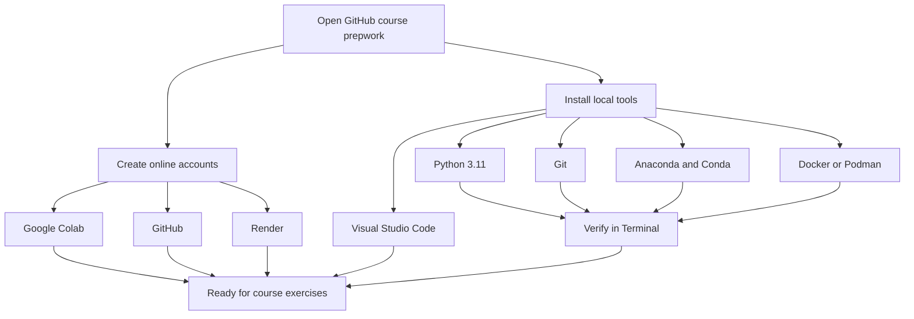
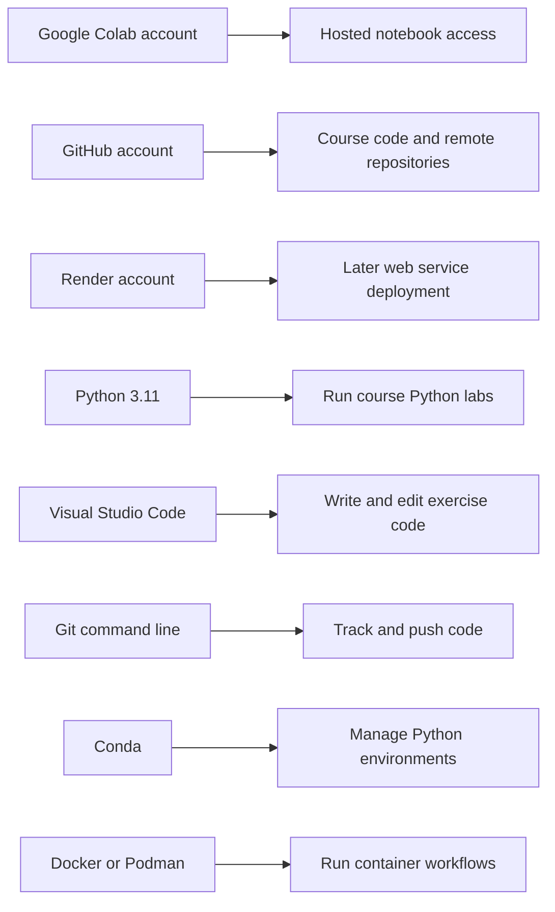
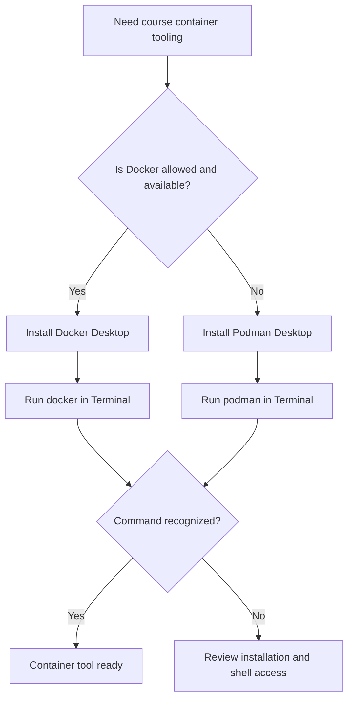
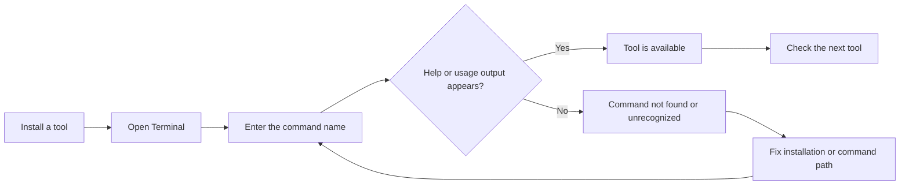

# Course Setup: From Empty Machine to Ready Workspace

**Visual goal:** See how accounts, local tools, and Terminal verification combine into a course-ready development environment.

[Read the detailed summary](./Summary.md)

## Big picture



### Visual learning path

1. Start with the `00` prepwork instructions in the course repository.
2. Prepare the accounts that provide notebooks, code hosting, and deployment.
3. Install the local coding and runtime tools.
4. Choose Docker Desktop or Podman Desktop according to availability and policy.
5. Verify command-line tools in Terminal.
6. Begin the exercises only after the required checks succeed.

## 1. What each setup item enables



| Setup item | Type | Role in the course | Important note |
|---|---|---|---|
| Google Colab | Account | Hosted notebook work | A Google account can be used |
| GitHub | Account | Access and host code | Different from installing Git |
| Render | Account | Deploy web services later | Introduced for session 03 work |
| Python 3.11 | Local software | Run Python labs | Recommended course version |
| Git | Local software | Version control from Terminal | Used instead of relying only on a GUI |
| VS Code | Local software | Main code editor | Exercises are written here |
| Anaconda and Conda | Local software | Easier environment management | Recommended, not presented as mandatory |
| Docker or Podman | Local software | Container tooling | Podman is the alternative if Docker is restricted |

## 2. Container tool decision



## 3. Verification loop



Useful checks from the lesson:

```bash
git
conda
python
docker
```

Use `podman` instead of `docker` when Podman Desktop is the selected container tool.

> **Mental model:** The accounts are keys to external services, the installed applications are tools on your workbench, and Terminal checks prove that the workbench is actually usable.

## Check your understanding

1. Why is creating a GitHub account not enough to use Git from Terminal?
2. Why does the instructor recommend Python 3.11?
3. What later course activity is the Render account intended to support?
4. When should a learner choose Podman Desktop instead of Docker Desktop?
5. What Terminal result suggests that an installation still needs attention?

