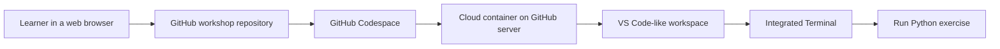
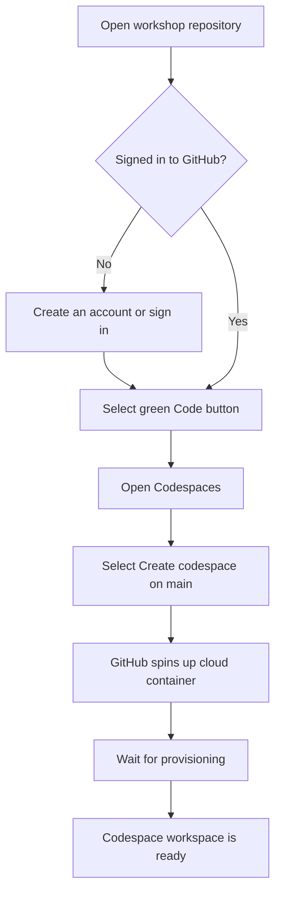
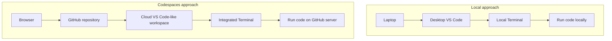
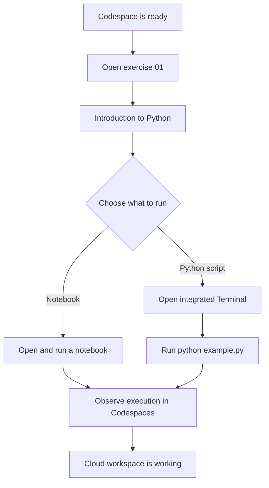
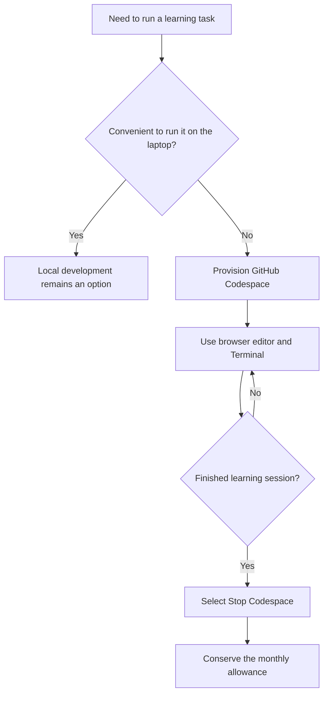

# GitHub Codespaces: From Repository to Cloud Workspace

**Visual goal:** Understand how a learner creates, uses, verifies, and stops a GitHub Codespace without running the workshop code directly on a laptop.

[Read the detailed summary](./Summary.md)

## Big picture



### Visual learning path

1. Decide whether a cloud workspace is more convenient than running code locally.
2. Sign in to GitHub and open the workshop repository.
3. Create a codespace from the repository's **Code** menu.
4. Wait while GitHub provisions the cloud container and workspace.
5. Use the VS Code-like editor and integrated Terminal.
6. Run exercise `01` to confirm that Python code works.
7. Stop the codespace when the session is complete.

## 1. Exact setup journey



## 2. Local laptop and Codespaces mapping

| Learning need | Local approach | Codespaces approach |
|---|---|---|
| Open an editor | Desktop VS Code | VS Code-like browser workspace |
| Enter commands | Laptop Terminal | Integrated Codespaces Terminal |
| Execute Python | Local machine | Cloud container on GitHub's server |
| Store the active environment | Laptop resources | Provisioned codespace workspace |
| End the session | Close local tools | Select **Stop Codespace** |



> **Mental model:** A GitHub repository is the entry point, **Create codespace on main** starts a cloud container, and the browser becomes the window into a VS Code-like workspace running on GitHub's server.

## 3. Verify the workspace with the course exercise



Command demonstrated in the lesson:

```bash
python example.py
```

## 4. Usage decision and shutdown habit



The instructor states that a free GitHub account has `120 hours per month` for Codespaces and describes that amount as sufficient for learning.

## Check your understanding

1. Which repository button and section lead to **Create codespace on main**?
2. What does GitHub provision after the learner requests a new codespace?
3. How is the Codespaces interface similar to desktop Visual Studio Code?
4. Which command is used to demonstrate the `example.py` exercise?
5. Why should the learner select **Stop Codespace** after finishing?
