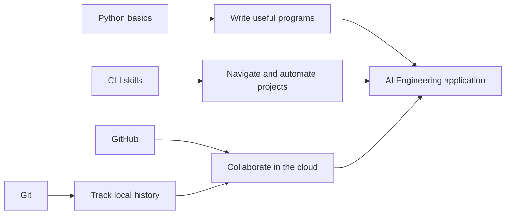
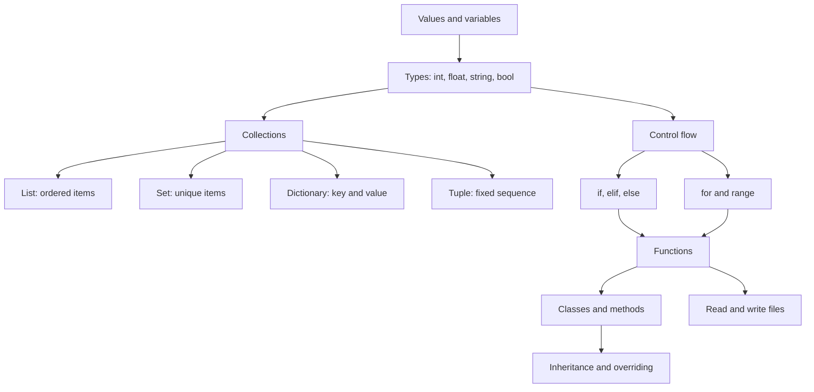
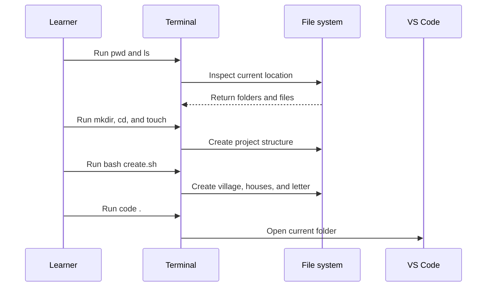
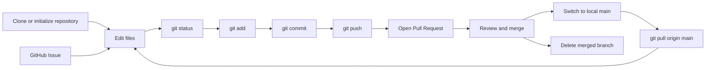

# Python, CLI, and GitHub: The Foundation Workflow

**Visual goal:** See how Python logic, terminal skills, and Git collaboration connect to form a practical foundation for AI Engineering.

[Read the detailed summary](./Summary.md)

## Big picture

The lesson moves from writing logic, to operating files and tools, to sharing changes with a team.

### Visual learning path

1. Learn how data and control flow through Python.
2. Use the CLI to create, inspect, and automate a project structure.
3. Use Git to turn file changes into a reliable history.
4. Use GitHub branches, Pull Requests, and Issues to coordinate work.

## 1. How Python programs are assembled

Python starts with values and data structures, then adds decisions, repetition, reusable functions, and objects.

| Concept | Mental mapping | Typical use |
|---|---|---|
| Variable | Labeled value | Store a name, year, or total |
| Conditional | Decision gate | Choose output for a numeric range |
| Loop | Repeated path | Sum values or count items |
| Function | Reusable machine | Accept parameters and return a result |
| Class | Blueprint | Combine attributes and behavior |

`print()` and f-strings make invisible program state visible. A loop often uses an accumulator, while a function places that logic behind a reusable name. Python ranges are zero-indexed, so `range(n)` starts at `0` and stops before `n`.

## 2. CLI as the project's control surface

The terminal lets a developer manipulate the same folders and files that Python and Git use. Bash scripts turn a repeated command sequence into an executable procedure.

Manual commands teach cause and effect. A `.sh` file captures those commands so the result can be recreated consistently. `echo` can reveal progress when debugging a script.

## 3. Git and GitHub collaboration loop

| Tool | Scope | Main responsibility |
|---|---|---|
| Git | Local machine | Track changes, commits, and branches |
| GitHub | Cloud collaboration | Host repositories, review Pull Requests, manage Issues |
| Feature branch | Isolated line of work | Keep unfinished changes away from `main` |
| Pull Request | Review boundary | Discuss and merge a proposed change |

> **Mental model:** Python is the logic workshop, the CLI is the control panel, Git is the project time machine, and GitHub is the shared collaboration space.

## Check your understanding

1. How do variables, conditionals, loops, and functions build on one another?
2. Why automate the village folder exercise with Bash after creating it manually?
3. What is the difference between a local Git commit and a GitHub Pull Request?
4. Why should work happen on a feature branch before it is merged into `main`?
5. After a Pull Request is merged, how does the local `main` receive the change?
