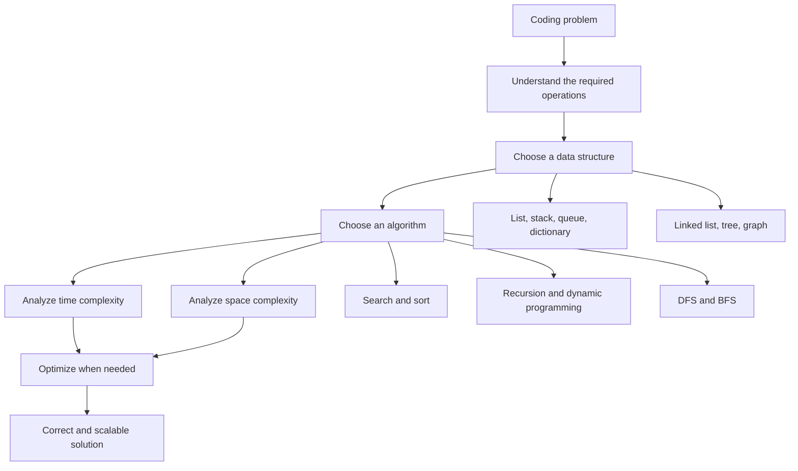
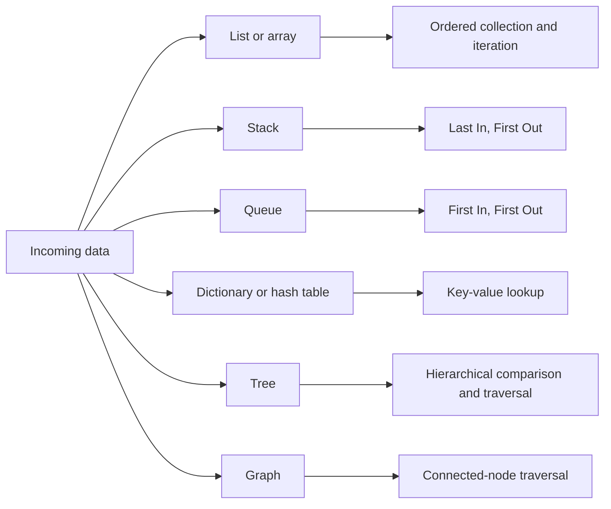
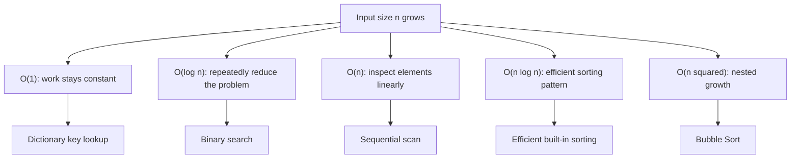
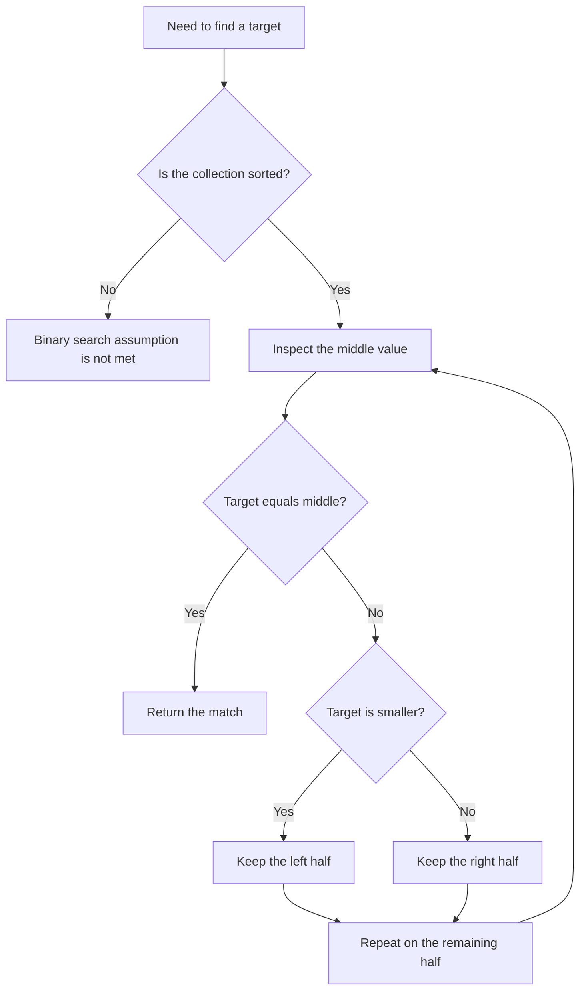
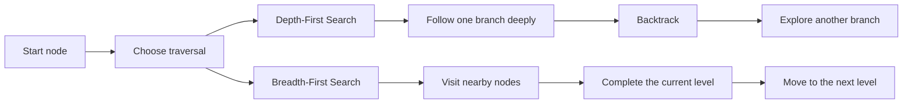
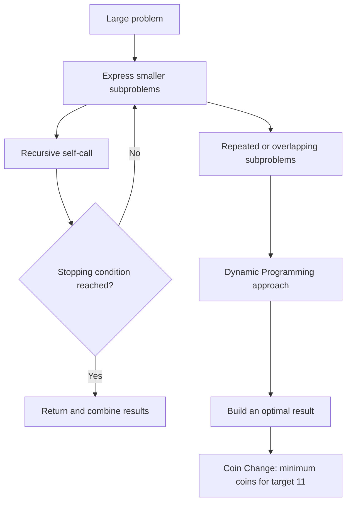

# Data Structures and Algorithms: The Interview Basics Map

**Visual goal:** Connect data representation, algorithm choice, and complexity before practicing individual coding problems.

[Read the detailed summary](./Summary.md)

## Big picture

### Visual learning path

1. Learn what each structure stores and which operations it makes natural.
2. Read Big O as growth in work or memory, not as an exact runtime.
3. Compare linear search with binary search.
4. Compare simple sorting with more efficient sorting.
5. Recognize recursive and dynamic programming problem shapes.
6. Compare deep-first and level-first traversal.
7. Practice selecting the structure and algorithm together.

## 1. Data structure behavior map

| Structure or method | Core mental picture | Typical operation highlighted | Complexity idea from the lesson |
|---|---|---|---|
| List or array | Ordered row of elements | Loop or search through values | A full scan is `O(n)` |
| Linked list | Nodes connected by pointers | Follow links from node to node | Search commonly requires traversal |
| Stack | Pile of books | Remove the latest item | LIFO |
| Queue | Customer line | Serve the earliest item | FIFO |
| Dictionary | Key-value index | Retrieve by key | Typical lookup discussed as `O(1)` |
| Ordered binary tree | Repeated left or right choice | Narrow the search path | Search can follow `O(log n)` behavior |
| Graph | Network of connected nodes | Explore connections | Use traversal strategies such as DFS or BFS |

## 2. Complexity growth map

Time complexity asks how work grows. Space complexity asks how storage grows. Both should be considered in the worst-case scenario discussed by the instructor.

## 3. Binary search decision flow

## 4. DFS and BFS traversal contrast

| Question | DFS | BFS |
|---|---|---|
| First movement | Down one branch | Across the current level |
| Thai memory cue | `ไปลึกก่อน` | `เชิงกว้างก่อน` |
| Revisit behavior | Backtrack after reaching depth | Continue level by level |
| Shared purpose | Explore connected nodes | Explore connected nodes |

## 5. From recursion to dynamic programming

> **Mental model:** A data structure is the shape of your storage, an algorithm is the route through that shape, and Big O tells you how the journey grows when the data becomes large.

## Check your understanding

1. Why can a dictionary lookup avoid the full scan required by a list search?
2. What assumption must hold before binary search can repeatedly discard half of the data?
3. Why is Bubble Sort useful to learn even though Python already provides efficient sorting?
4. How does `ไปลึกก่อน` distinguish DFS from BFS?
5. In the Coin Change example, what is being minimized?

