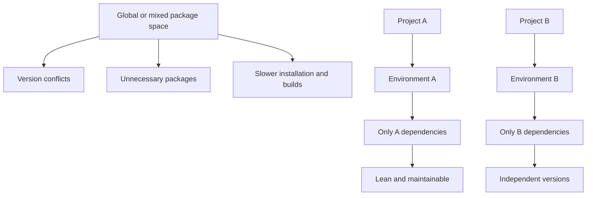
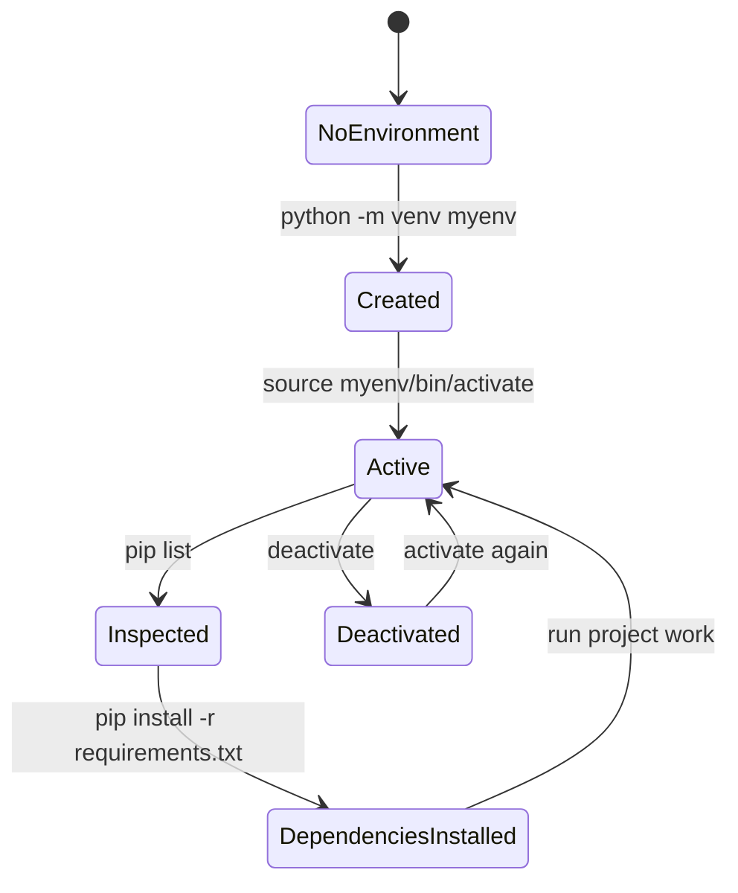
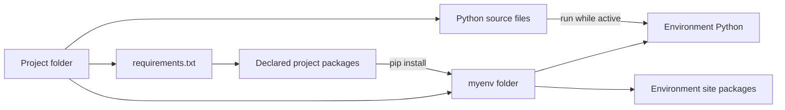
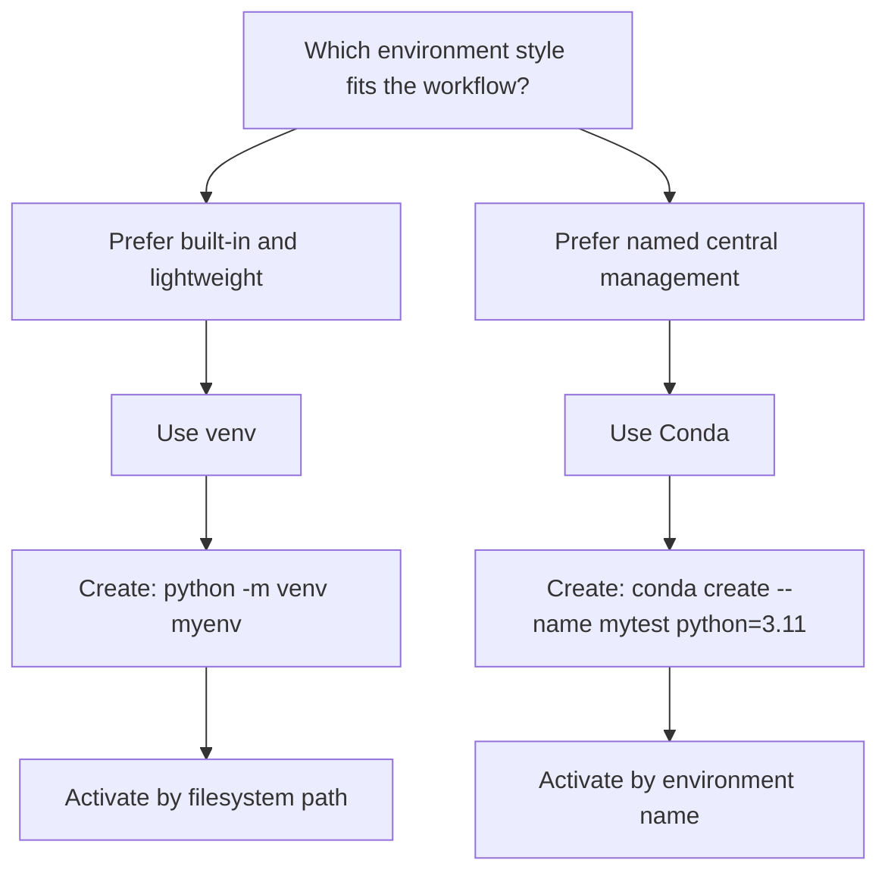
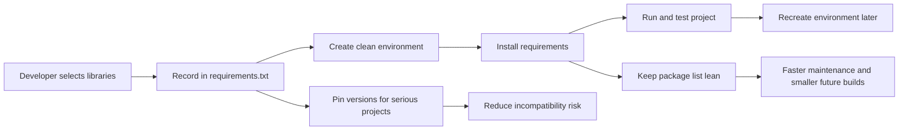

# Python Virtual Environments: Isolate Each Project

**Visual goal:** Understand how `venv`, Conda, and dependency files keep Python projects separate, lean, and reproducible.

[Read the detailed summary](./Summary.md)

## Big picture

A virtual environment creates a boundary around one project's Python interpreter and installed packages. The project should contain only the dependencies it needs.

### Visual learning path

1. Identify why globally mixed packages create risk.
2. Create a clean environment for one project.
3. Activate it before installing or running project code.
4. Install the declared dependencies from `requirements.txt`.
5. Deactivate it when switching context.
6. Choose either project-local `venv` or centrally managed Conda and use it consistently.

## 1. Environment lifecycle with `venv`

Creating an environment and activating it are separate actions. Creation builds the folder. Activation changes which Python and package set the shell uses.

`pip list` is a useful checkpoint. A newly created environment should begin with very few packages. After installation, it should show the libraries required by the project and their supporting dependencies.

## 2. `venv` and Conda mapping

| Concern | Python `venv` | Conda |
|---|---|---|
| Installation | Built into Python | Requires Conda or Anaconda |
| Storage model | Folder inside or near project | Managed in a central location |
| Activation | Uses a filesystem path | Uses an environment name |
| Weight | Lightweight | More tooling and disk usage |
| Best fit | Simple project-local isolation | Convenient listing and switching |

Neither tool is universally better. Both provide the important boundary between projects. Conda can also specify the Python version during creation, as shown with Python 3.11.

## 3. Dependencies across development stages

The same principle appears in other ecosystems. Python commonly uses `requirements.txt` plus an environment, while JavaScript commonly declares dependencies in `package.json`. The syntax differs, but the goal is the same: each project declares its own needs.

Virtual environments are the development isolation layer. Production containerization is a related but later concern, not a replacement demonstrated in this lesson.

> **Mental model:** Treat each project as a separate room. The virtual environment is the room, `requirements.txt` is its packing list, activation opens its door, and deactivation returns you to the hallway.

## Check your understanding

1. Why can one global package collection create dependency conflicts?
2. What is the difference between creating and activating a `venv`?
3. Why should `pip list` be small in a fresh environment?
4. How does Conda activation differ from `venv` activation?
5. Why should production-oriented projects pin dependency versions?
