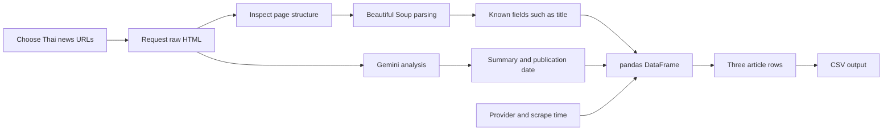
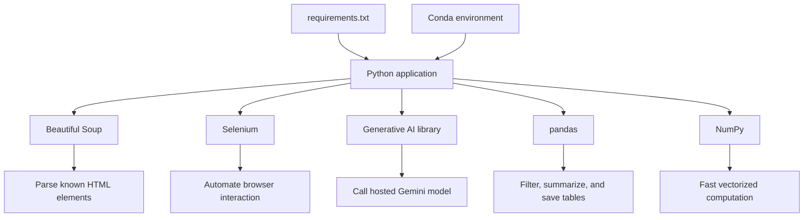
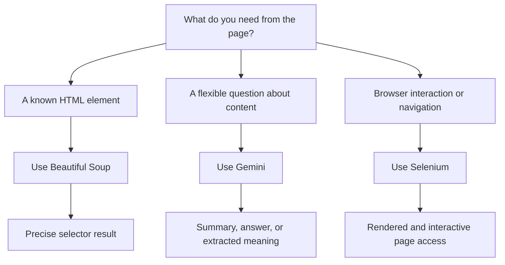
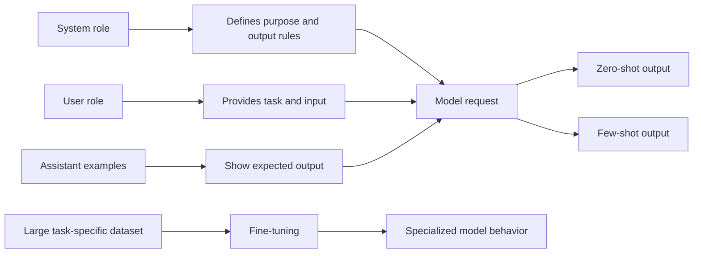
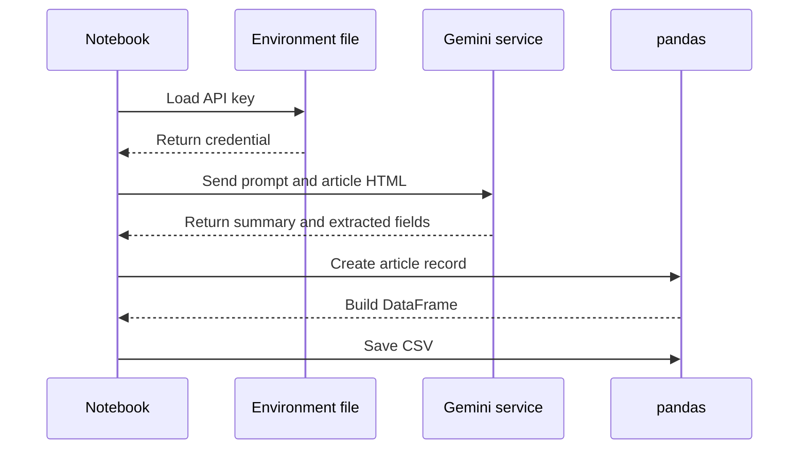

# Applications of Python: From Libraries to an AI Data Pipeline

**Visual goal:** See how isolated environments, scraping, Generative AI, pandas, and optimized libraries combine into practical Python applications.

[Read the detailed summary](./Summary.md)

## Big picture

This lesson turns Python syntax into a workflow that retrieves information, interprets it, structures it, and saves a useful result.

### Visual learning path

1. Create an isolated Python 3.11 environment and install project requirements.
2. Select that environment as the local notebook kernel.
3. Import reusable functions and third-party libraries.
4. Retrieve HTML and decide between deterministic parsing and natural-language analysis.
5. Store extracted results in a pandas DataFrame.
6. Use NumPy when numerical work needs vectorized performance.

## 1. Libraries extend Python

Top-level requirements often install additional packages because libraries have dependencies of their own. Version pinning matters when reproducibility and compatibility become important.

| Tool | Input | Best use | Output |
|---|---|---|---|
| Beautiful Soup | HTML | Select known tags or elements precisely | Parsed text or attributes |
| Selenium | Live browser | Navigate and interact with pages | Browser-driven results |
| Gemini | Prompt plus content | Flexible summary, extraction, or generation | Natural-language response |
| pandas | Structured records | Filter, analyze, and export tabular data | DataFrame or CSV |
| NumPy | Numeric arrays | Fast vectorized operations | Computed arrays |

## 2. Deterministic parsing versus Generative AI

For the Naewna Thai news example, browser developer tools connect the visible Thai headline and publication information to the underlying HTML. Beautiful Soup is suitable when the location is known. Gemini is useful when the request varies, such as summarizing the article or answering when it was published.

## 3. Prompting and model adaptation

| Adaptation | Examples provided | Effort | Recommended starting point |
|---|---:|---:|---|
| Zero-shot | None | Low | Yes |
| Few-shot | Several demonstrations | Low to medium | Yes, when format needs guidance |
| Fine-tuning | Larger training dataset | High | Only when stronger specialization is justified |

Temperature changes variability, while top-p and top-k restrict candidate tokens. Maximum output tokens limits response length. Token behavior can differ across languages, including Thai.

## 4. Secure API flow and structured output

The API key belongs in `.env`, not directly in notebook code. The key controls service access, limits, and possible billing.

The pandas stage turns loosely gathered results into rows and columns. It can filter rows, calculate descriptive statistics, return unique values, and round-trip data through CSV. NumPy complements this workflow when large numeric operations are a bottleneck, as shown by the major speed difference in the lecture's 100 million value power operation.

> **Mental model:** Python is an integration workbench. Libraries supply specialized tools, prompts translate flexible questions into model tasks, and pandas turns the answers into a dependable table.

## Check your understanding

1. When is Beautiful Soup a better choice than Gemini for extraction?
2. Why can `pip list` contain more packages than `requirements.txt`?
3. How do system, user, and assistant roles shape a few-shot prompt?
4. Why must the Gemini API key stay outside source code?
5. How does the three-article assignment move from HTML to CSV?
