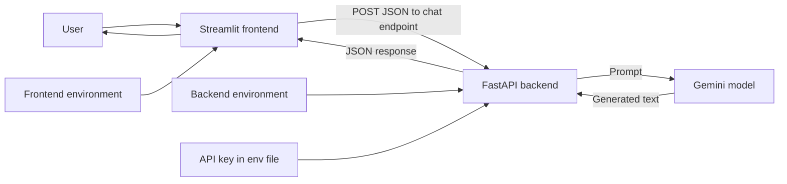
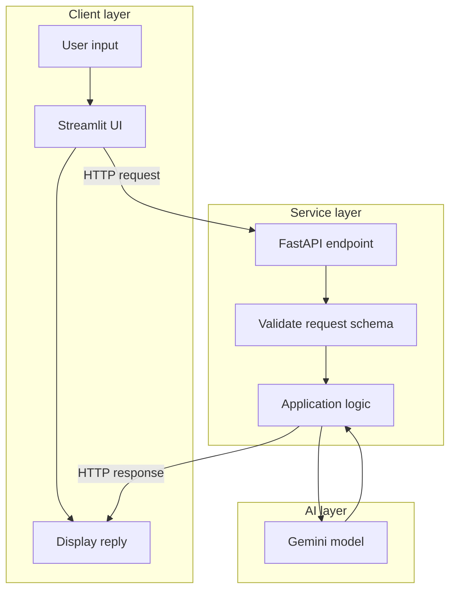
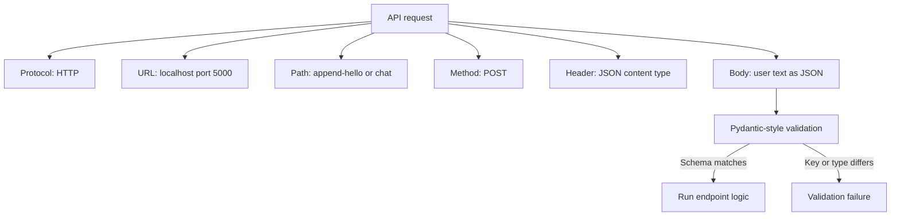
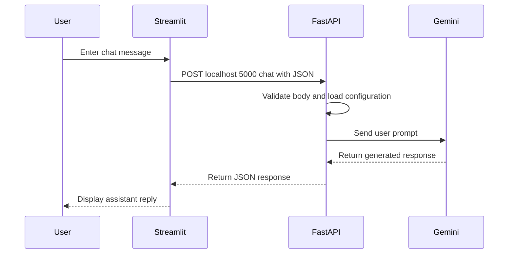
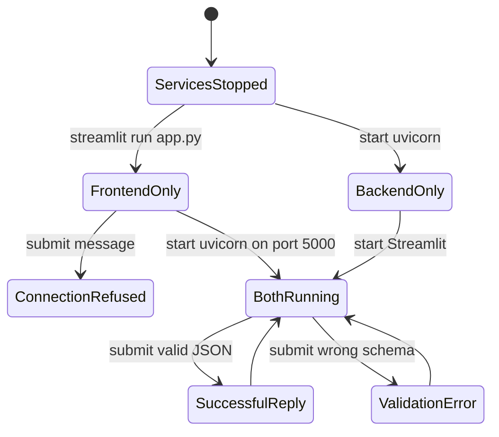

# Basics of Web Applications: Streamlit, FastAPI, and Gemini

**Visual goal:** Understand how a user message travels through a Streamlit frontend, a FastAPI backend, and Gemini before the reply appears on screen.

[Read the detailed summary](./Summary.md)

## Big picture

The application has three layers with distinct responsibilities and dependency sets.

### Visual learning path

1. Build and run the Streamlit interface by itself.
2. Build and test the FastAPI endpoint by itself.
3. Learn the request parts that connect a client to an endpoint.
4. Run frontend and backend in separate terminals.
5. Replace the hard-coded or echoed backend response with Gemini output.
6. Extend the frontend with conversation history.

## 1. Layered architecture and ownership

| Layer | Main responsibility | Example dependency |
|---|---|---|
| Frontend | Collect input and render the interface | Streamlit |
| Backend | Validate requests and run business logic | FastAPI |
| AI layer | Generate a response from the prompt | Gemini client |
| Configuration | Provide secret service credentials | `.env` loading |

Separate `requirements.txt` files and virtual environments prevent frontend packages from being mixed unnecessarily with backend and AI packages.

## 2. Anatomy of the REST request

The lecture introduces REST operations including `GET`, `POST`, `UPDATE`, and `DELETE`, while the practical application focuses on `POST`. The body field name and type must match the backend's expected schema.

## 3. End-to-end chat sequence

Testing the backend first with `curl` or a Python client separates API problems from user-interface problems. The earlier `/append-hello` endpoint makes the behavior visible by returning the supplied text with `Hello` appended. The `/chat` endpoint then evolves from a hard-coded reply, to an echo, to Gemini-generated output.

## 4. Runtime states and troubleshooting

| Symptom | Visual diagnosis | Next check |
|---|---|---|
| Connection refused | Frontend cannot reach a listening backend | Start FastAPI and verify host and port |
| Validation failure | JSON does not match expected field or type | Compare body with request schema |
| UI works but no AI reply | Backend or Gemini configuration failed | Check backend logs and `.env` loading |
| Package missing | Wrong environment may be active | Activate the service's environment |

Development uses `uvicorn app:app --reload --port 5000`. Reload is useful during editing, but production startup should omit it and use an appropriate host.

The optional conversation-history exercise adds previous user and assistant turns to Streamlit session state. Each new turn is appended, displayed, and sent to the backend when conversational context is needed.

> **Mental model:** Streamlit is the conversation window, FastAPI is the receptionist and coordinator, Gemini is the specialist, and HTTP plus JSON is the message envelope passed between them.

## Check your understanding

1. Which responsibilities belong to Streamlit, FastAPI, and Gemini?
2. What request parts must be correct for the `/chat` call to work?
3. Why does the frontend show connection refused when FastAPI is not running?
4. Why should the backend be tested independently before connecting the UI?
5. Where should conversation history live, and when should it be sent to the backend?
