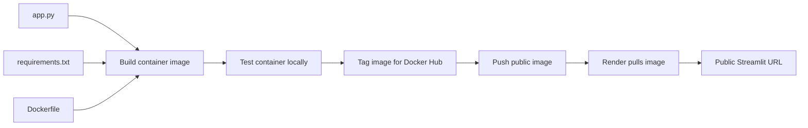
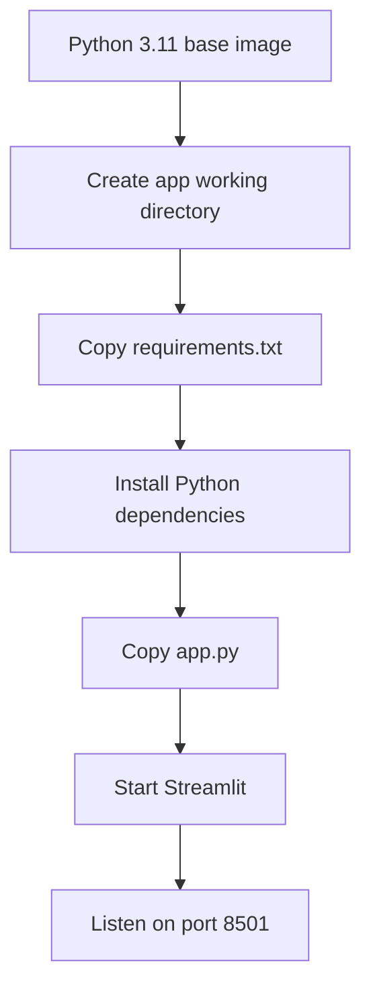
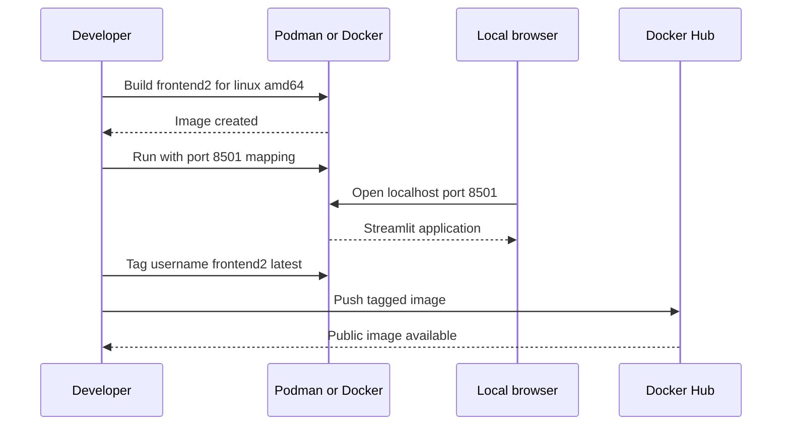
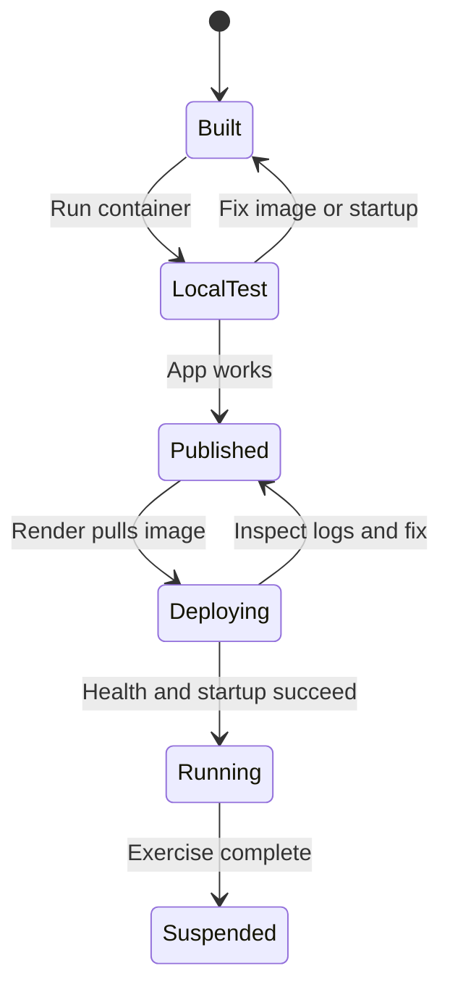
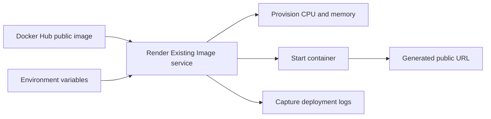

# Deploying a Streamlit Frontend Service

**Visual goal:** See how local application files become a tested container image, a Docker Hub artifact, and finally a public Render web service.

[Read the detailed summary](./Summary.md)

## Big picture: source to public URL

The deployment artifact is the container image. Render does not build from the course repository in this workflow. It pulls the already-built public image from Docker Hub using the **Existing Image** option.

## What the Dockerfile connects

| Piece | Responsibility | Key detail |
|---|---|---|
| `app.py` | Defines the Streamlit user interface | Runs inside the container |
| `requirements.txt` | Lists Python packages | Installed while building the image |
| `Dockerfile` | Defines image construction and startup | Must start Streamlit correctly |
| Port `8501` | Carries browser traffic to Streamlit | Must be mapped locally and available on the host |
| `linux/amd64` | Target image platform | Used because Render expects this architecture in the demonstration |

## Build, verify, publish

The local test is a deployment gate. If the container cannot start and serve the app locally, publishing it only moves the same problem to Render.

## Render's role

The demonstrated frontend needs no environment variables. A backend may need runtime configuration such as API keys, which should be supplied through Render settings rather than embedded in the image.

### Managed container hosting versus a virtual machine

| Managed service such as Render | Manually operated VM |
|---|---|
| Pulls and starts the container | Requires server provisioning and setup |
| Provides logs and a public URL | Requires networking and process management |
| Offers resource and replica controls | Scaling must be designed and operated |
| Suitable for this simple service | Offers more control but more operational work |

> **Mental model:** Treat the image as a sealed, portable application package. Local testing proves the package works, Docker Hub stores and distributes it, and Render supplies the managed runtime and public endpoint.

## Visual learning path

1. Understand the three source files and how the Dockerfile assembles them.
2. Build specifically for `linux/amd64`.
3. Run locally with `8501:8501` and verify in a browser.
4. Tag the same image as `<dockerhub-username>/frontend2:latest`.
5. Push it to Docker Hub, then connect Render to that exact image.
6. Watch logs, verify the public URL, and suspend the service when finished.

## Check your understanding

1. Why should the container be tested locally before it is pushed?
2. What is the relationship between Streamlit and port `8501`?
3. Does tagging rebuild or duplicate the image?
4. Which system stores the image, and which system runs it publicly?
5. When would Render environment variables become necessary?
