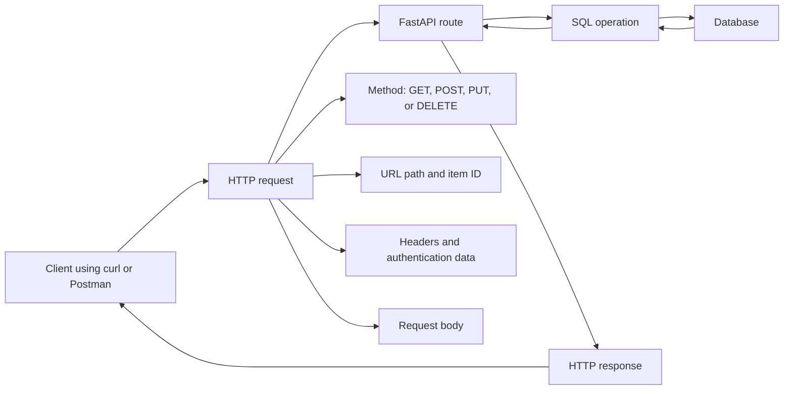
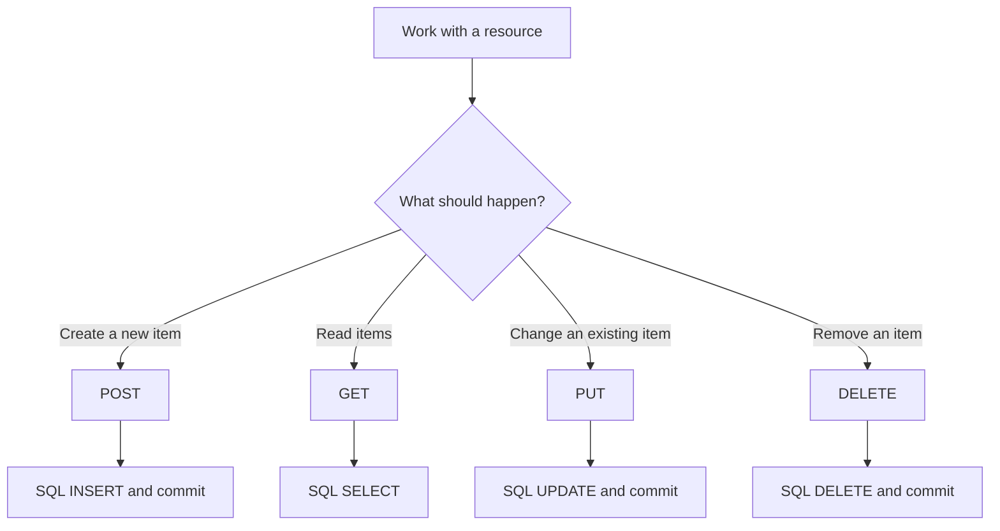
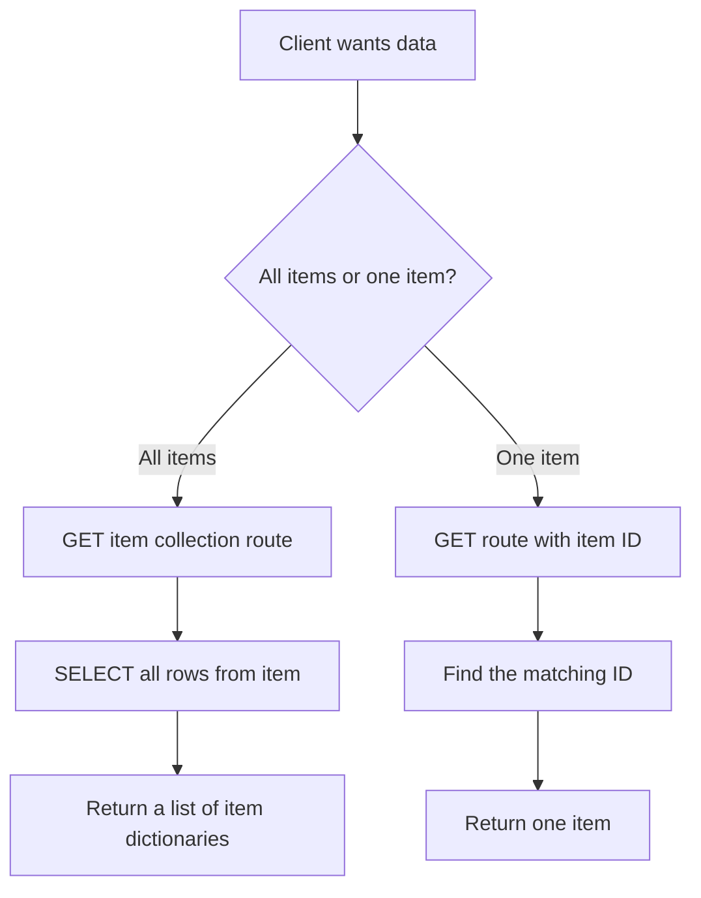
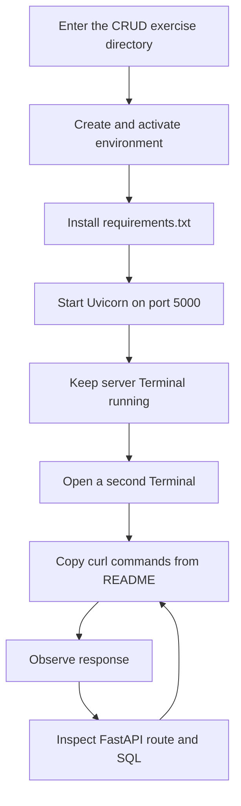

# REST APIs and CRUD: Request to Database and Back

**Visual goal:** See how HTTP methods, FastAPI routes, and SQL operations form one complete resource lifecycle.

[Read the detailed summary](./Summary.md)

## Big picture



### Visual learning path

1. Review the parts of an API request.
2. Map each CRUD intention to its HTTP method.
3. Start the FastAPI server and keep it running.
4. Send requests from a second Terminal with `curl`.
5. Trace each route into its SQL operation.
6. Verify creates, updates, and deletes by reading the data again.
7. Repeat the same lifecycle with Postman if a graphical client is preferred.

## 1. CRUD mapping



| User intention | Booking analogy | HTTP method | Database operation | Expected result |
|---|---|---|---|---|
| View hotels or bookings | Browse all or one booking | `GET` | `SELECT` | Existing data is returned |
| Make a booking | Create a new reservation | `POST` | `INSERT` | A new row and ID are created |
| Change booking details | Move to a different date | `PUT` | `UPDATE` | The selected row changes |
| Cancel a booking | Remove the reservation | `DELETE` | `DELETE` | The selected row disappears |

## 2. Collection route and item route



The URL path tells FastAPI which resource is targeted. Adding an item ID narrows the request from the collection to one resource.

## 3. Create, verify, update, verify, delete, verify


This verification loop is important. A success response is useful, but a subsequent read demonstrates the resulting database state.

## 4. Runtime workflow



Server command shown in the lesson:

```bash
uvicorn app:app --reload --port 5000
```

## 5. Request tool comparison

| Concern | `curl` | Postman |
|---|---|---|
| Interface | Terminal command | Graphical application |
| Request method | Written in command options | Selected in the interface |
| URL, headers, and body | Encoded in the command | Entered in separate fields |
| Repeating an example | Re-run or edit the command | Save and resend the request |
| Lesson preference | Used in the demonstration | Offered as an alternative |

> **Mental model:** An HTTP method is a verb, the URL is the noun, FastAPI is the dispatcher, SQL performs the storage action, and the response reports what happened.

## Check your understanding

1. Which HTTP method and SQL operation create a new item?
2. How does an item collection route differ from a route containing an item ID?
3. Why should database writes be committed?
4. Why does the exercise run a `GET` after each create, update, or delete?
5. Which request parts can carry the endpoint, authentication information, and submitted item details?

