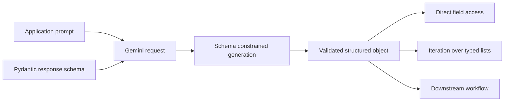
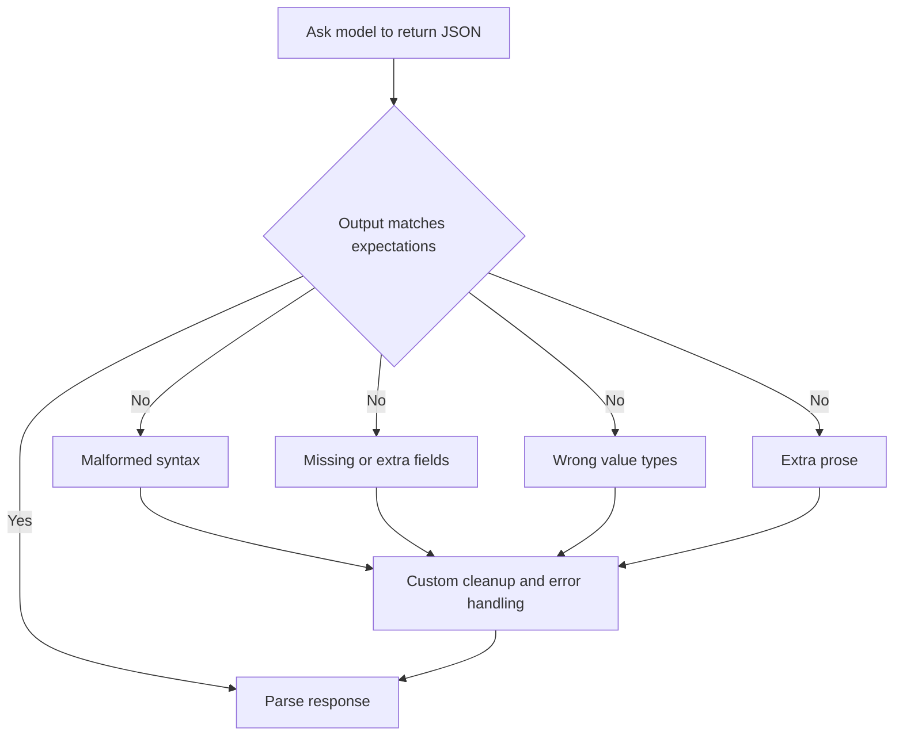
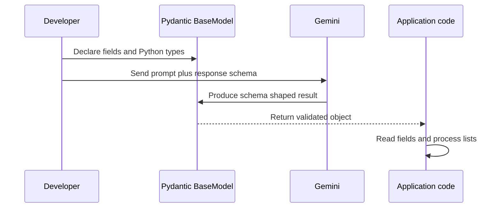
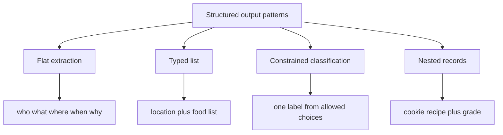
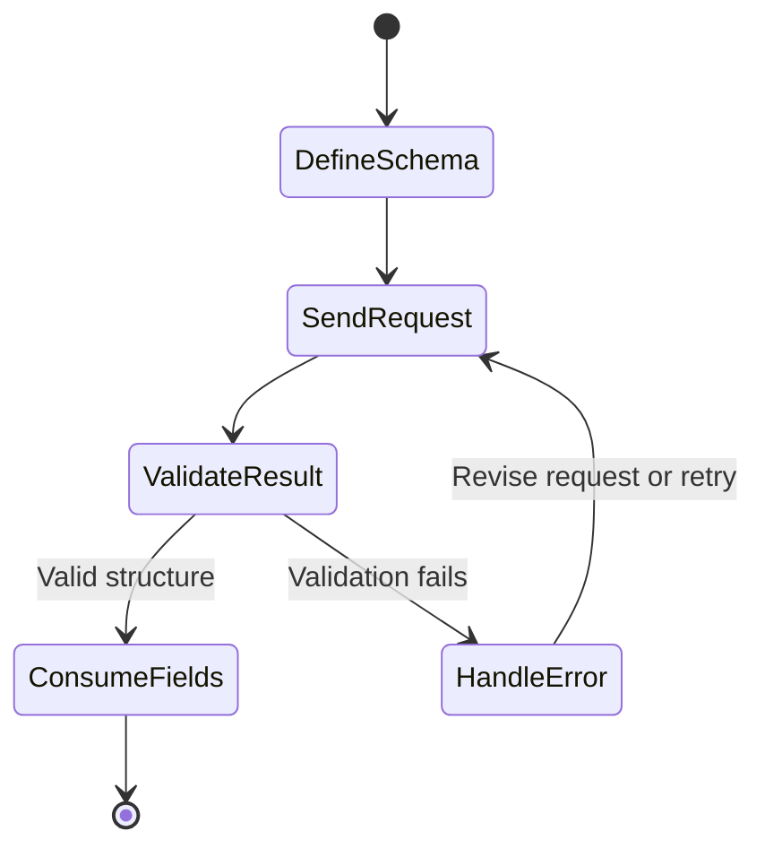

# Structured Outputs for Reliable LLM Responses

**Visual goal:** Understand how a Pydantic schema turns an unpredictable LLM text response into a typed contract that application code can consume safely.

[Read the detailed summary](./Summary.md)

## Big picture: from text request to typed data

A prompt can request JSON, but a schema defines the actual contract. The contract specifies field names, Python types, allowed values, and nested structures.

## Why prompt-only JSON is fragile

Structured output moves much of this defensive work into a declared schema and provider-supported response mechanism.

| Approach | Output guarantee | Application work |
|---|---|---|
| Free-form response | Natural language only | Interpret text manually |
| "Return JSON" prompt | Desired shape is suggested | Parse and handle malformed results |
| Structured output with Pydantic | Response must follow declared fields and types | Access validated values directly |
| Constrained category | Value must come from an allowed set | Route workflow using known labels |

## Pydantic is the contract layer

Python inheritance matters here. A custom model inherits validation behavior from `BaseModel`. For example, declaring `x: int` establishes that an acceptable instance must contain an integer-compatible value.

## Schema patterns shown in the lecture

| Pattern | Example fields | What it enables |
|---|---|---|
| Flat extraction | `who`, `what`, `where`, `when`, `why` | Direct access such as `.who` |
| Typed collection | `location`, `food: list[str]` | Immediate Python iteration |
| Fixed choice | News, intent, sentiment, or topic label | Predictable routing value |
| Nested collection | Recipe name and constrained grade | Production-oriented multi-record data |

The grade example restricts values to choices such as `A+`, `A`, `B`, `C`, `D`, and `F`. The schema guarantees the form and allowed value, although it does not guarantee that the model's judgment is semantically correct.

## Production data path

> **Mental model:** A prompt describes the task, while the schema defines the interface boundary. The LLM supplies values, Pydantic defines their shape, and ordinary Python code consumes the result.

## Visual learning path

1. Identify why free-form text is risky for downstream code.
2. Define the smallest Pydantic model that represents the needed answer.
3. Pass that model as the Gemini response schema.
4. Read fields directly instead of extracting them with regular expressions.
5. Add lists, allowed categories, or nested models as the application contract grows.
6. Practice with a news article schema containing `date`, `summary`, and `title`.

## Check your understanding

1. Why is asking for JSON not equivalent to enforcing a schema?
2. What behavior does a class inherit from Pydantic `BaseModel`?
3. Which schema pattern is appropriate for intent detection?
4. What can a constrained grade guarantee, and what can it not guarantee?
5. How does structured output reduce custom parsing code?
