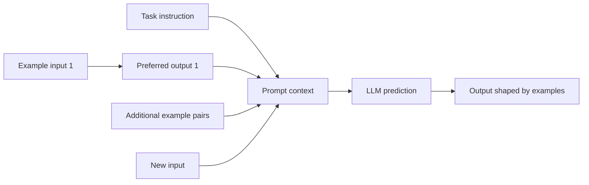
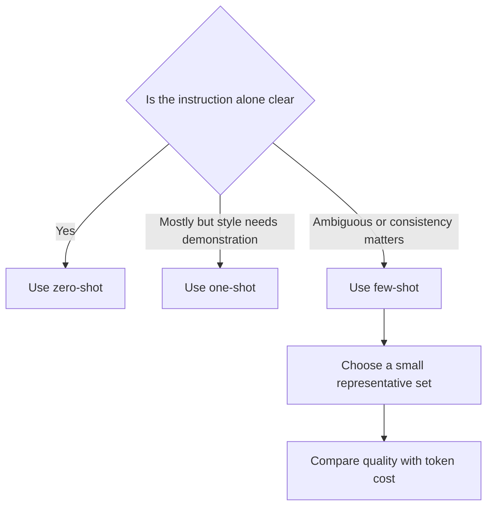
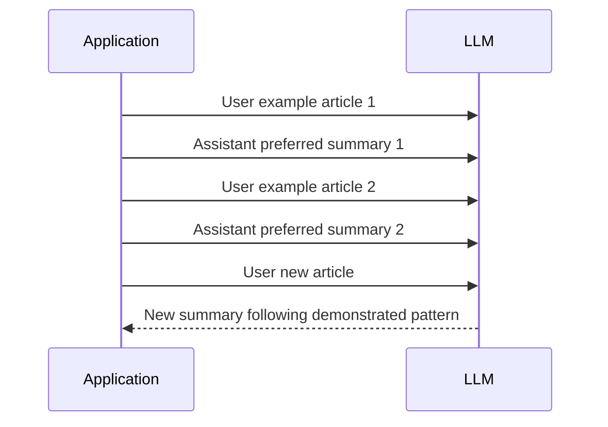
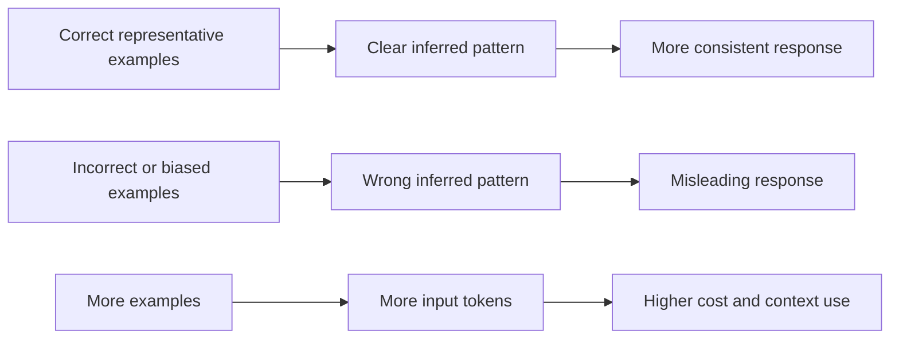
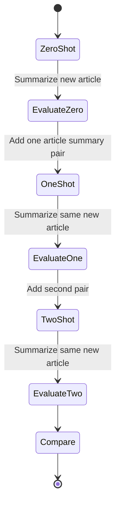

# Few-Shot Prompting

**Visual goal:** See how example input-output pairs placed before a new request guide an LLM toward a desired behavior, label set, style, or format without retraining it.

[Read the detailed summary](./Summary.md)

## Big picture: examples become temporary guidance

Few-shot prompting changes the context for the current request. It does not train, fine-tune, or permanently modify the model.

## Zero-shot to few-shot spectrum

| Method | Examples before new input | Best fit |
|---|---:|---|
| Zero-shot | 0 | Clear task with sufficient instructions |
| One-shot | 1 | Concrete target for style or format |
| Few-shot | Commonly 2 to 5 | Ambiguous task, label coverage, or stronger consistency |

For sentiment classification, a useful few-shot set might demonstrate positive, neutral, and negative labels. For summarization, examples demonstrate the preferred length, organization, and tone.

## Message ordering is the mechanism

Each demonstration is paired: a `user` example input is followed by the exact `assistant` output that should be imitated. The final `user` message contains the real input to process.

Example quality matters more than adding examples only for quantity. Examples should be correct, relevant, and diverse enough to clarify the expected behavior.

## One-shot and two-shot summarization

Compare the outputs on:

| Dimension | Question to ask |
|---|---|
| Format | Does the answer follow the demonstrated structure? |
| Conciseness | Is the summary close to the target length? |
| Consistency | Would repeated inputs produce similarly shaped answers? |
| Coverage | Do examples represent the task's important cases? |
| Token usage | Is the quality improvement worth the larger prompt? |

> **Mental model:** Examples are temporary demonstrations placed inside the model's working context. They act like showing, not training: "When the input looks like this, respond like that."

## Visual learning path

1. Start with a clear zero-shot instruction and record the result.
2. Add one high-quality input-output pair to make the target concrete.
3. Add a second representative pair only if it clarifies another important pattern.
4. Keep role ordering exact: user example, assistant answer, then new user input.
5. Compare quality, consistency, and token usage using the same test article.
6. Stop adding examples when extra prompt cost no longer produces meaningful improvement.

## Check your understanding

1. What distinguishes zero-shot, one-shot, and few-shot prompting?
2. Why must each example include both an input and its preferred output?
3. Does few-shot prompting permanently update model weights?
4. How can poorly labeled examples affect the final answer?
5. Why should token usage be included in the zero-shot versus few-shot comparison?
