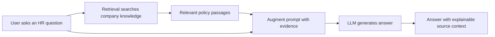
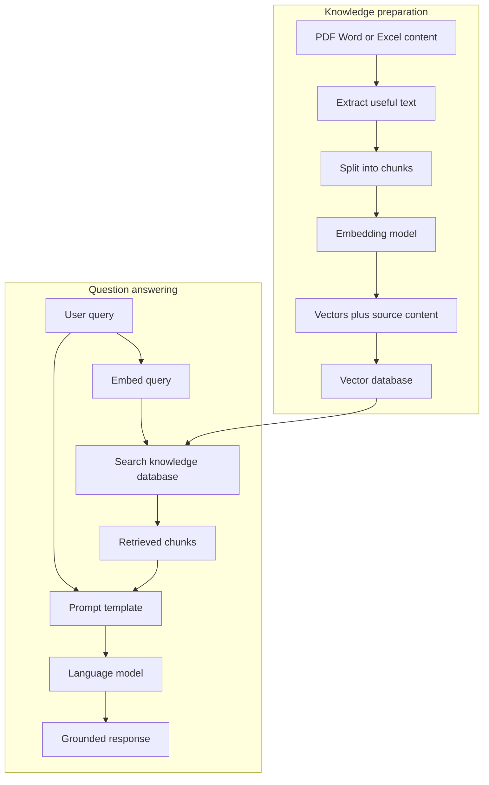
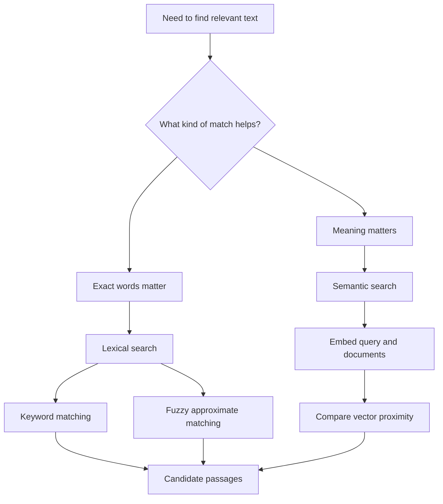
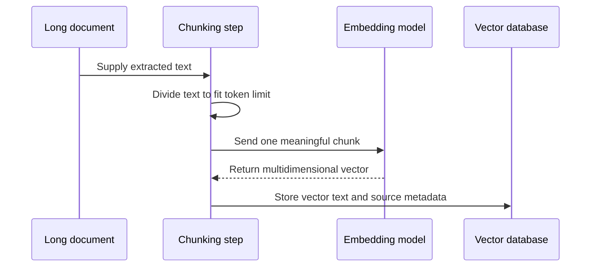
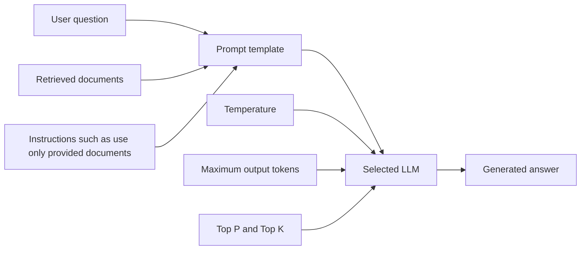

# Essential RAG Foundations Before AI Agents

**Visual goal:** See how knowledge preparation, search, prompt augmentation, and LLM generation connect to produce an evidence-grounded answer.

[Read the detailed summary](./Summary.md)

## Big picture

RAG gives a general-purpose model access to information it does not already know, such as a company's private leave policy.

## The two preparation and runtime paths

> **Mental model:** RAG is an open-book answer process. Retrieval chooses the pages to open, augmentation places those pages beside the question, and generation writes the response from that evidence.

## Search methods map

| Search approach | What it matches | Useful when |
|---|---|---|
| Lexical search | Exact words or patterns | Product codes, named terms, precise phrases |
| Fuzzy search | Approximate spellings | Queries may contain small typing errors |
| Semantic search | Similar meaning | Query wording differs from the document |
| Combined retrieval | Words plus meaning | A system needs both precision and broader recall |

## Why embedding and chunking belong together

An embedding model has a finite token limit. Chunking makes long files acceptable to the model and lets retrieval return only the focused passages needed for a question.

## From retrieved evidence to generation

| Component | Main decision |
|---|---|
| Knowledge source | Is it authoritative for the use case? |
| Chunking | Does each unit fit while preserving meaning? |
| Embedding model | Does it retrieve well in the target language? |
| Vector database | Can it store and search vectors with source content? |
| Prompt | Does it tell the model how to use retrieved evidence? |
| LLM | Does it generate reliably in the required language? |
| Parameters | Is the output length and variability appropriate? |

## Visual learning path

1. Start with the HR policy question and identify why a general model cannot answer it reliably.
2. Trace how source documents become chunks, embeddings, and vector records.
3. Compare lexical, fuzzy, and semantic search.
4. Follow retrieved passages into a prompt template.
5. Observe how model selection and generation parameters affect the final answer.
6. Implement the basic pipeline manually before adding a framework.

## Check your understanding

1. Which RAG stage finds the HR policy passages needed for an employee's question?
2. Why must long documents often be divided into chunks before embedding?
3. How does semantic search differ from a `Ctrl+F` style lexical search?
4. What information is added during the augmented stage?
5. Why should Thai-language embedding and generation models be evaluated specifically for Thai?

