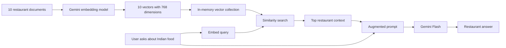
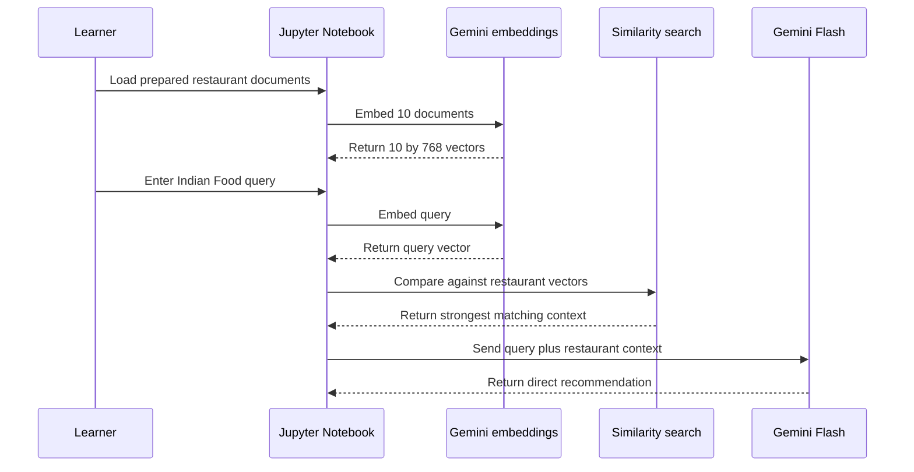
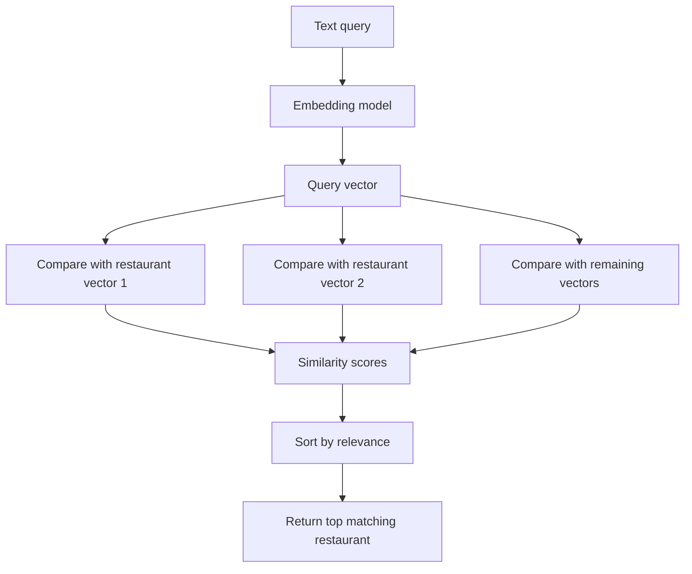
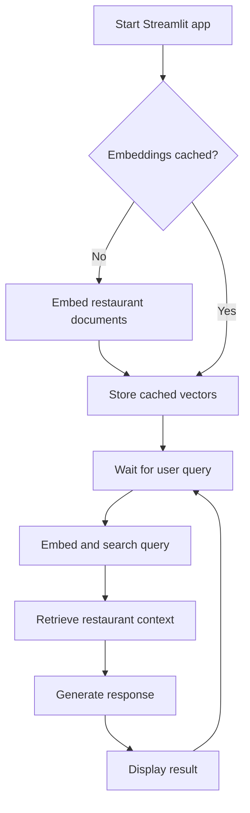
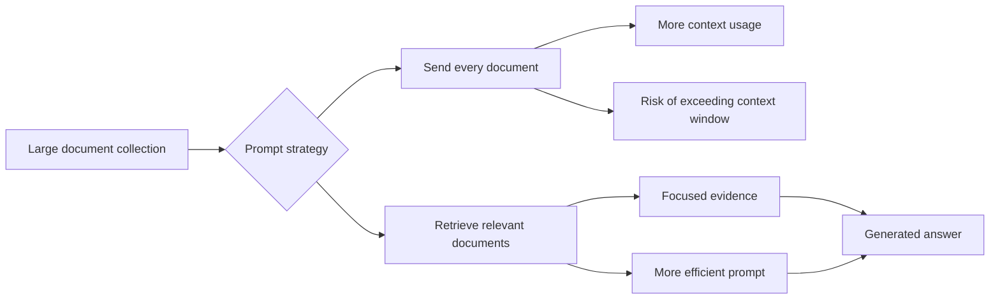

# Coding a Simple Restaurant RAG Application

**Visual goal:** Follow the same RAG logic from document embeddings in Jupyter to a cached, interactive Streamlit application.

[Read the detailed summary](./Summary.md)

## End-to-end view



The demo prepares searchable knowledge first, then uses that knowledge for every question.

## Notebook execution sequence



> **Mental model:** The notebook is a transparent assembly line. Each cell exposes one RAG operation, so you can verify document preparation, query retrieval, prompt construction, and generation before hiding them behind an app.

## Semantic search mechanics



| Item | Demo implementation | Production direction mentioned |
|---|---|---|
| Documents | 10 cleaned restaurant descriptions | Larger, continuously managed collection |
| Vector size | 768 dimensions | Depends on selected embedding model |
| Storage | Jupyter or app memory | ChromaDB, Milvus, FAISS, or Elasticsearch |
| Search | Basic similarity comparison | More advanced retrieval techniques |
| Interface | Minimal Streamlit app | Application-specific user experience |
| Reuse | Cache restaurant embeddings | Persistent indexed storage |

## From notebook functions to Streamlit



Start the interface with:

```bash
streamlit run app.py
```

Caching avoids repeating stable document-embedding work whenever the page refreshes.

## Why retrieve instead of sending everything



| RAG stage | Input | Output |
|---|---|---|
| Prepare | Restaurant descriptions | Document vectors |
| Retrieve | Query vector plus document vectors | Relevant restaurant context |
| Augment | Query plus retrieved context | Completed prompt |
| Generate | Completed prompt | Natural-language answer |

## Visual learning path

1. Inspect the 10 prepared restaurant documents.
2. Create and examine the 10 by 768 embedding shape.
3. Embed `Indian Food` and compare it with all document vectors.
4. Inspect the highest-scoring restaurant context.
5. Add that context and the original query to the prompt.
6. Generate the response with Gemini Flash.
7. Reuse the functions in Streamlit and verify caching.
8. Replace the documents and questions as the assigned exercise.

## Check your understanding

1. Why must the query use the same embedding approach as the restaurant documents?
2. What is stored in memory during this demonstration?
3. Why does retrieval help even if an LLM could accept several documents directly?
4. What work does Streamlit caching avoid?
5. Which parts of the notebook pipeline are reused in the web application?

