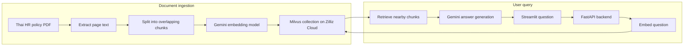
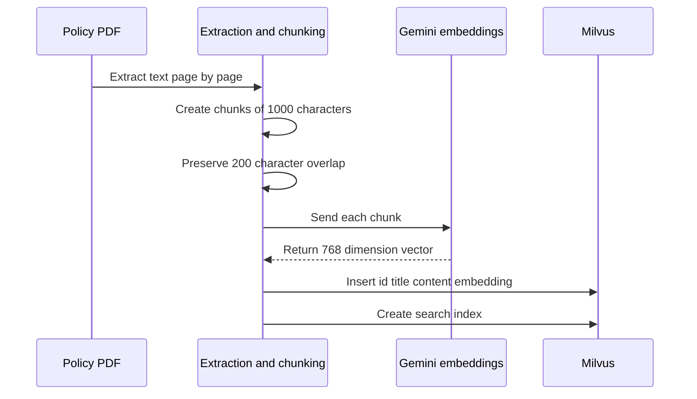
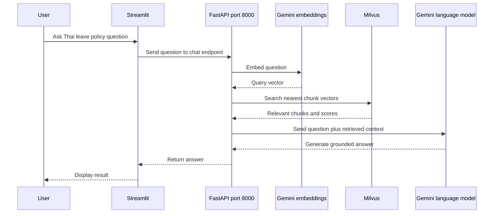
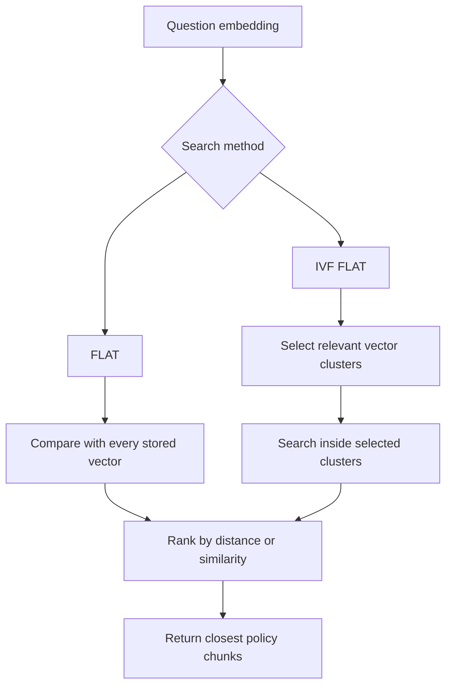
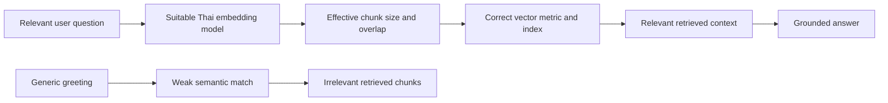

# End-to-End RAG with Milvus, FastAPI, and Streamlit

**Visual goal:** Connect the offline document-ingestion pipeline with the online question-answering path, and see where chunking, embeddings, Milvus, retrieval, and Gemini each contribute.

[Read the detailed summary](./Summary.md)

## Big picture: two journeys, one knowledge base

The ingestion journey prepares searchable knowledge before users ask questions. The query journey reuses the same embedding space to find policy chunks whose meanings are close to the question.

## Ingestion pipeline

Overlap keeps neighboring context around chunk boundaries. The chunk CSV is the bridge between document preparation and vector ingestion.

| Collection field | Meaning |
|---|---|
| `id` | Unique record identifier |
| `title` | Document or page label |
| `chunk_content` | Searchable policy text |
| `embedding` | 768-dimensional semantic vector |

Connection details for hosted Milvus belong in `.env`, not in source code.

## Retrieval and grounded answer generation

Streamlit owns interaction and display. FastAPI owns retrieval and answer orchestration. Milvus stores searchable knowledge. Gemini performs both embedding and answer generation, using different model capabilities.

## How vector search narrows meaning

| Concept | Interpretation |
|---|---|
| L2 distance | Lower distance means vectors are closer |
| Cosine similarity | Compares vector direction |
| Inner product | Another vector matching metric |
| FLAT | Exhaustive comparison across all vectors |
| IVF_FLAT | Cluster first, then search a narrower region |

Indexing improves search efficiency as the collection grows. It does not automatically fix weak embeddings or poorly chosen chunks.

## Quality depends on the whole retrieval chain

The lecture uses Google's free `text-embedding-004` model, but notes that it is not necessarily the strongest model for Thai retrieval. Thai-capable models should be compared using MTEB or similar benchmarks.

> **Mental model:** RAG is a two-stage answer system. Retrieval first selects evidence from the document collection, then generation turns that evidence into a readable answer. If retrieval supplies poor evidence, the generation stage has little reliable material to use.

## Visual learning path

1. Extract the five-page Thai policy PDF and inspect page-level text.
2. Chunk it with size `1000` and overlap `200`.
3. Embed each chunk and store its text, metadata, and vector in `milvus_collection`.
4. Create an index and test retrieval with realistic Thai policy questions.
5. Start FastAPI on port `8000`, then run Streamlit separately.
6. Trace one question through embedding, vector search, context assembly, and answer generation.
7. Improve components independently, especially Thai embeddings, chunking, and deployment.

## Check your understanding

1. Why are document chunks and user questions embedded with the same embedding approach?
2. What problem does chunk overlap reduce?
3. Which service separates the Streamlit frontend from Milvus and Gemini logic?
4. Why can `hello` retrieve irrelevant HR policy chunks?
5. What does IVF_FLAT change compared with FLAT search?
