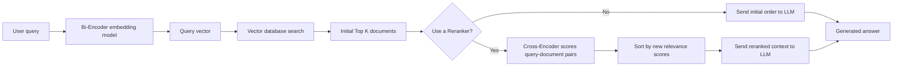
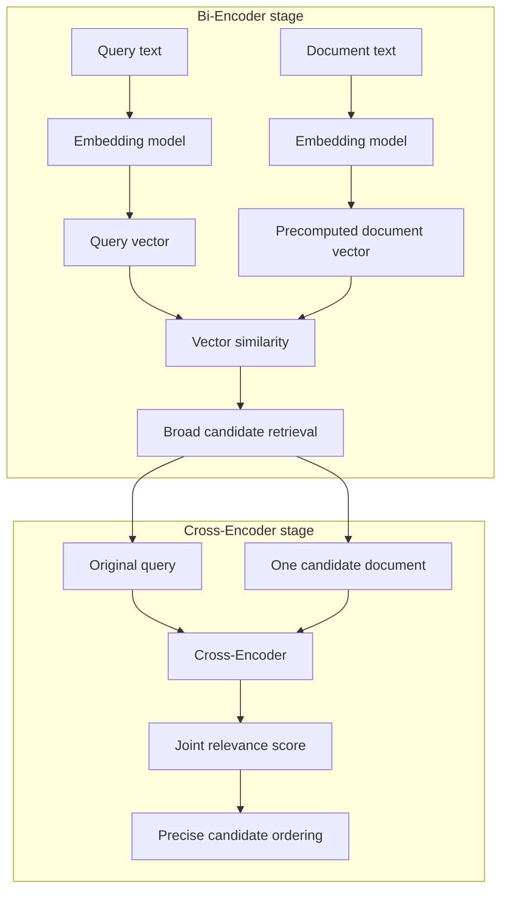
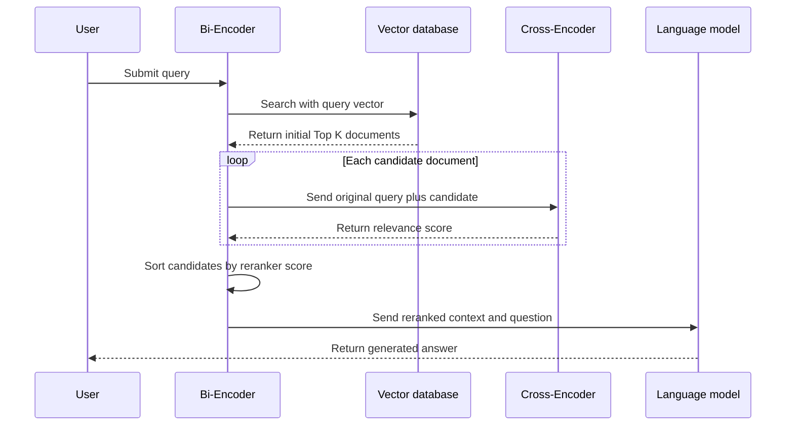
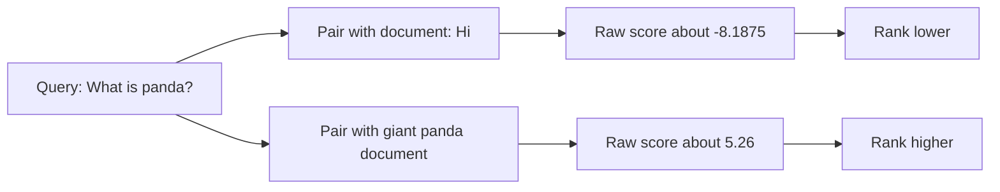
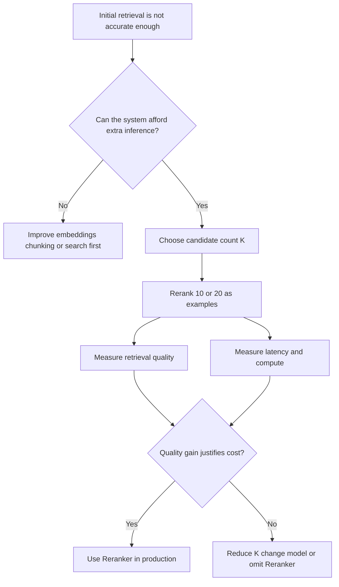

# Rerankers in Advanced RAG

**Visual goal:** See why advanced RAG uses fast vector retrieval first and a Cross-Encoder second to produce a more relevant document order.

[Read the detailed summary](./Summary.md)

## Traditional RAG and reranked RAG

The initial search efficiently narrows the full collection. The Reranker then spends more computation only on that smaller set.

## Bi-Encoder and Cross-Encoder mapping

| Property | Bi-Encoder embedding model | Cross-Encoder Reranker |
|---|---|---|
| Input | One text item at a time | Query and document together |
| Output | Vector | Relevance score |
| Document work | Can be precomputed | Recomputed for each query-document pair |
| Main job | Fast candidate retrieval | Precise candidate ordering |
| Scale | Suitable for searching many stored vectors | Best applied to a filtered candidate set |

> **Mental model:** The embedding model is a fast scout that finds a promising shortlist. The Reranker is a careful judge that reads the query beside every shortlisted document and rearranges the finalists.

## Reranking sequence for Top K

For K candidates, the Cross-Encoder must score K query-document pairs.

## Example score reordering

The score scale depends on the model. The useful operation is comparing scores and ordering candidates, not interpreting one score in isolation.

| Evaluation view | Without Reranker | With Reranker |
|---|---:|---:|
| Example MRR reported in lesson | About 0.65 | About 0.82 |
| Candidate order | Vector-search order | Cross-Encoder score order |
| Extra pair inference | None | One per candidate |
| Pipeline complexity | Lower | Higher |

## Accuracy versus resource decision

| Increasing K may provide | Increasing K also causes |
|---|---|
| More candidates for precise review | More Cross-Encoder computations |
| Better chance to recover a relevant result | Higher latency |
| Potentially stronger final ordering | Higher CPU or GPU resource usage |

## Visual learning path

1. Understand how a Bi-Encoder converts the query into one vector.
2. Observe the initial Top K returned from precomputed document vectors.
3. Pair the original query with each candidate document.
4. Inspect how the Cross-Encoder returns one relevance score per pair.
5. Sort the candidates and compare the order before and after reranking.
6. Measure both MRR and latency while changing K.
7. Decide whether the search improvement is worth the production cost.

## Check your understanding

1. Why is a Reranker normally applied after vector retrieval rather than to the whole database?
2. What does a Bi-Encoder return, and what does a Cross-Encoder return?
3. If Top K is 20, how many query-document pair evaluations are required?
4. Why can reranking improve the LLM's final answer even though it does not generate the answer itself?
5. Which measurements should be compared before enabling a Reranker in production?

