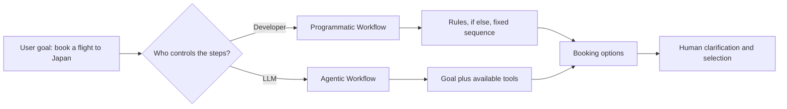
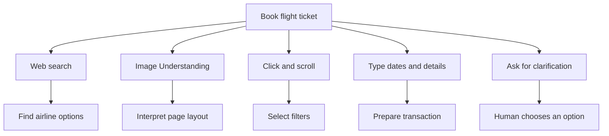
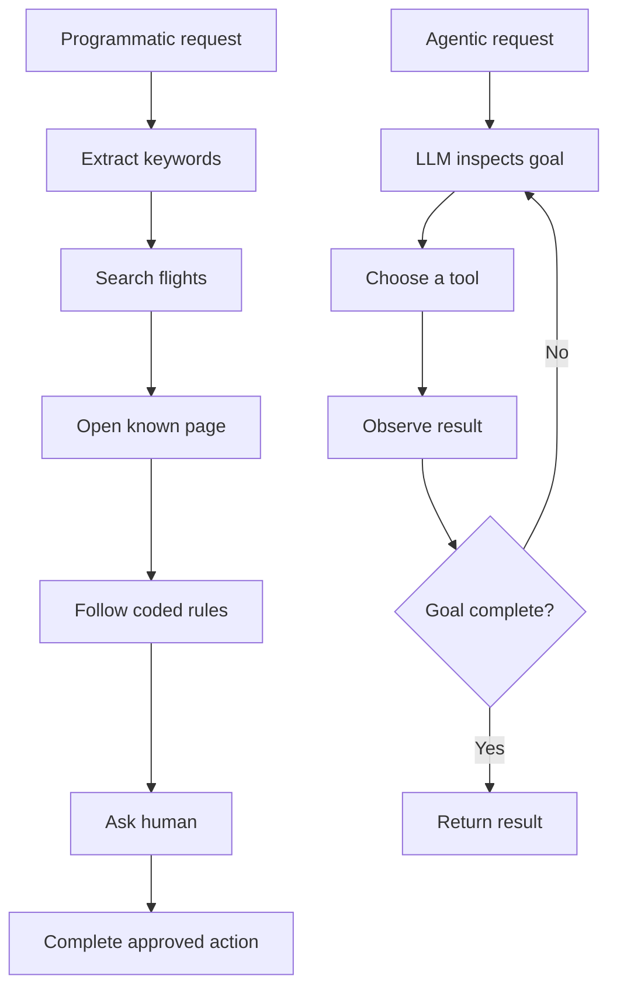
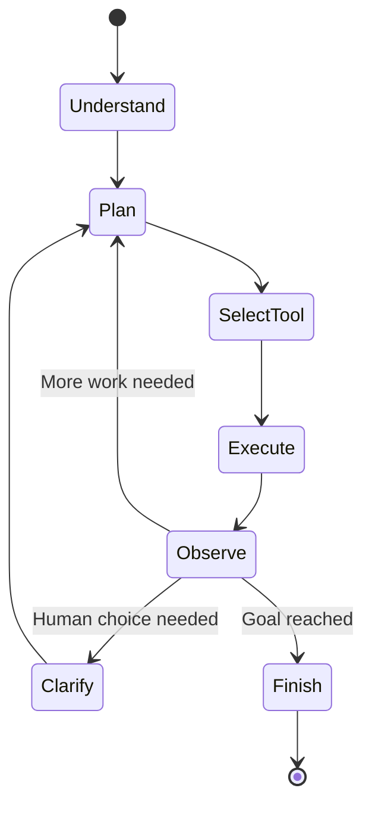
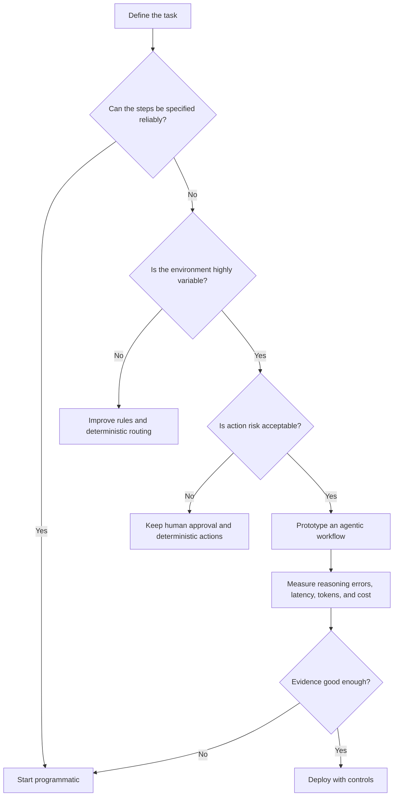

# AI Agents Explained Simply

**Visual goal:** See how the same flight-booking goal becomes either a fixed developer-controlled workflow or an autonomous LLM-controlled workflow.

[Read the detailed summary](./Summary.md)

## Big picture: goal, tools, and control

The same tools can appear in both systems. What changes is whether the developer or the LLM decides the order of actions.

## Tool map for the booking task

## Two control flows

| Dimension | Programmatic Workflow | Agentic Workflow |
|---|---|---|
| Decision maker | Developer | LLM |
| Build effort | Long for complex variations | Less explicit control-flow coding |
| Runtime | Fast | Slower planning loop |
| Predictability | High | Lower |
| Adaptation | Coded case by case | Potentially adapts from observations |
| Cost | Lower token use | More reasoning tokens |
| Main risk | Missing an unhandled case | Wrong AI reasoning or action |

> **Mental model:** Tools are the hands, the goal is the destination, and control flow is the driver. A programmatic system lets the developer drive. An agentic system lets the LLM drive, so its reasoning quality and safety boundaries become critical.

## Agentic reasoning loop

## Engineering decision tree

## Visual learning path

1. Start with the user's goal and list the required tools.
2. Notice that tools do not automatically make a system agentic.
3. Compare developer-controlled steps with the LLM planning loop.
4. Connect autonomy to reasoning quality, latency, token cost, and risk.
5. Choose programmatic control by default, then justify any move toward autonomy.

## Check your understanding

1. What is the defining control difference between a programmatic and an agentic workflow?
2. Why can an agent adapt to different websites more easily than a fixed script?
3. Why does agentic planning increase both latency and cost?
4. Which flight-booking step should include explicit human clarification?
5. Why does the instructor currently favor programmatic workflows for most production tasks?
