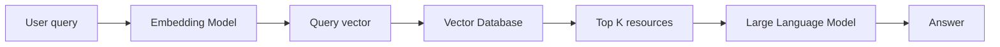
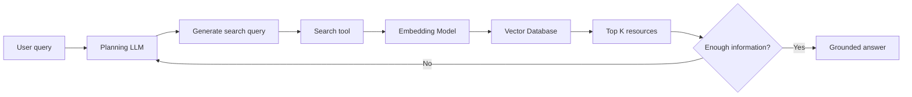
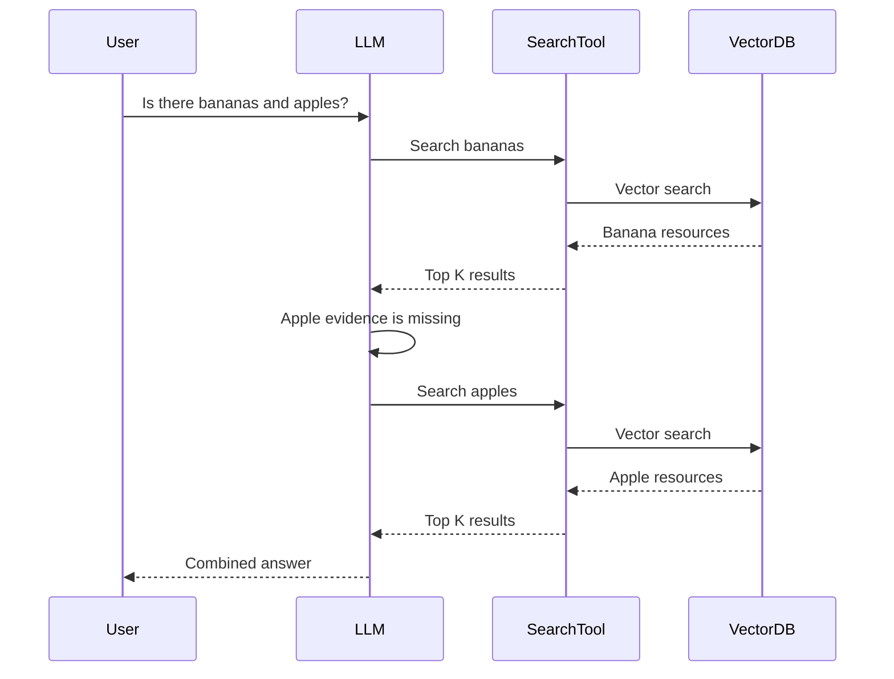
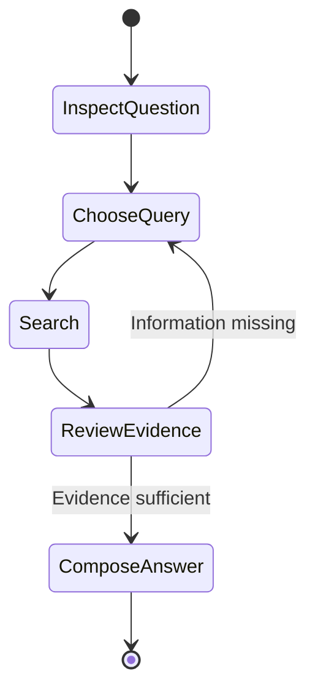
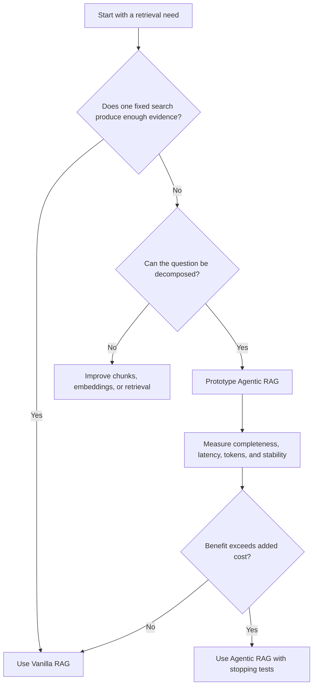

# Vanilla RAG vs Agentic RAG

**Visual goal:** See how a fixed retrieval pipeline becomes an LLM-controlled search loop that can decompose questions and retrieve repeatedly.

[Read the detailed summary](./Summary.md)

## Vanilla RAG: one programmed path

Every query follows the same pipeline, making the system predictable and easier to test.

## Agentic RAG: retrieval becomes a tool

The search tool may contain the same embedding and vector-search operations as Vanilla RAG. The new element is model-controlled planning and repetition.

## Compound question example

| Learning lens | Vanilla RAG | Agentic RAG |
|---|---|---|
| Workflow | Fixed | Dynamic |
| Query sent to retrieval | Original query | LLM-selected query |
| Retrieval rounds | Usually one | One or more |
| Compound questions | One combined search | Can split into sub-searches |
| Latency and tokens | Lower | Higher |
| Predictability | Higher | Lower |
| Base-model responsibility | Answer from context | Plan, search, judge, stop, answer |
| Testing effort | Smaller behavior space | More variable behavior |

> **Mental model:** Vanilla RAG is a conveyor belt. Every question rides through the same stations once. Agentic RAG is a researcher who can return to the library with a better query until enough evidence has been collected.

## Retrieval state loop

## When should the system stay simple?

## Visual learning path

1. Memorize the Vanilla RAG pipeline from query to grounded answer.
2. Wrap the retrieval portion as a search tool.
3. Put an LLM before the tool so it can choose the query.
4. Add evidence review and repeat-search behavior.
5. Compare quality gains against latency, tokens, unpredictability, and testing effort.

## Check your understanding

1. Which part of Vanilla RAG can be reused inside an Agentic RAG search tool?
2. Why might one combined search underperform for a bananas-and-apples question?
3. What new decisions does the LLM make in Agentic RAG?
4. Why can a smaller base model reduce Agentic RAG accuracy?
5. What measurements would prove that repeated retrieval is worth its cost?
