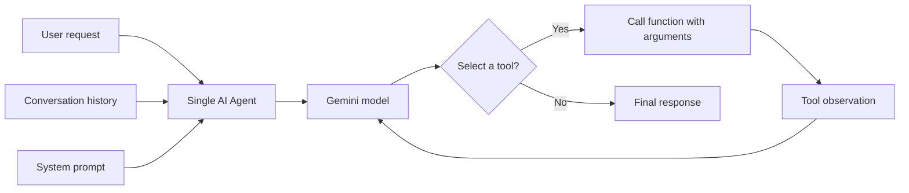
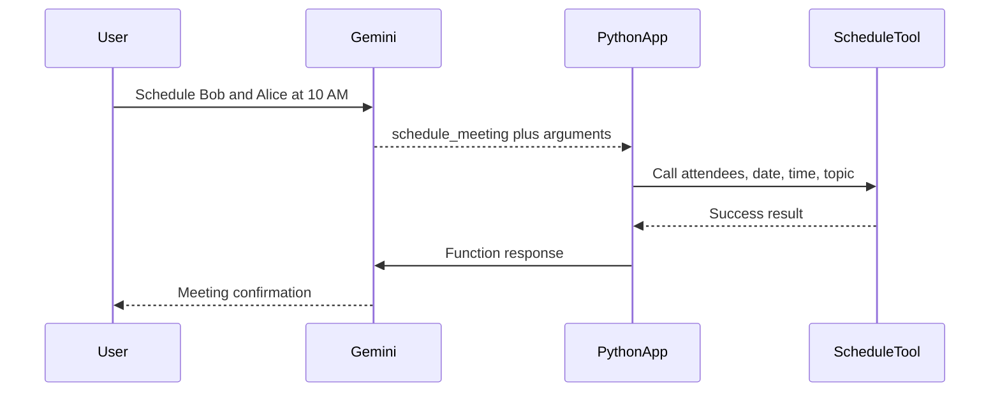
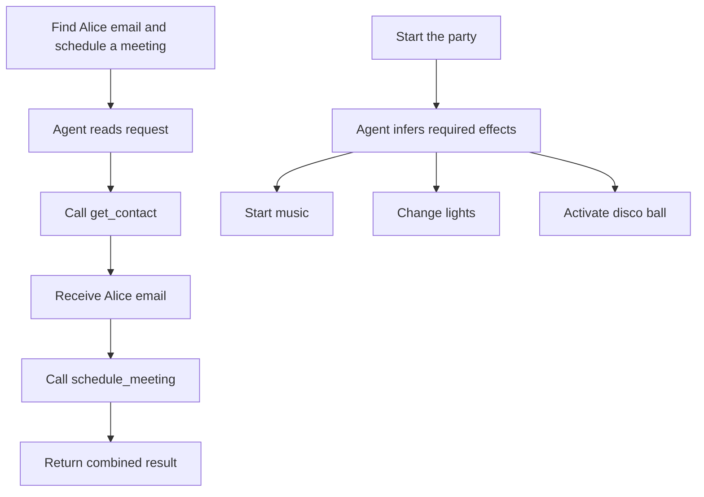
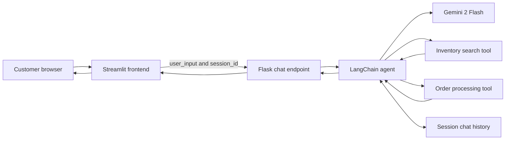
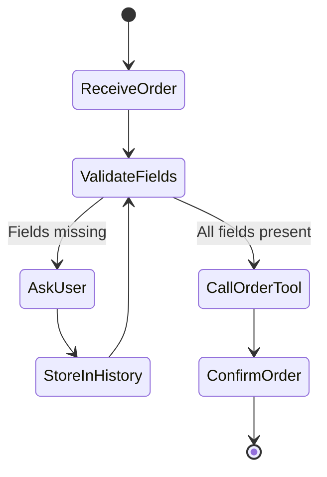
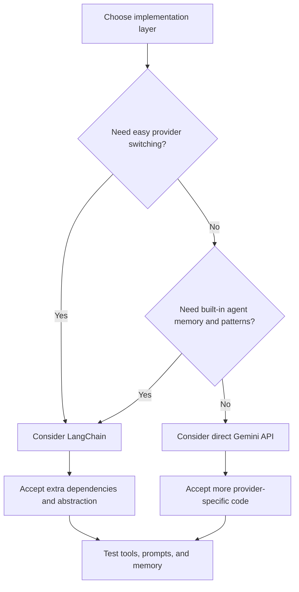

# Coding a Single AI Agent with Gemini and LangChain

**Visual goal:** Follow a user request from chat input through Gemini planning, LangChain tool execution, conversation memory, and the final application response.

[Read the detailed summary](./Summary.md)

## Single-agent anatomy

The model does not execute business logic by itself. It selects a registered function, supplies arguments, observes the result, and then responds.

## Meeting function-calling sequence

## Multi-tool reasoning

| Component | Main responsibility | Lesson example |
|---|---|---|
| User request | Express a goal in natural language | Schedule meeting or order apples |
| Model | Select tools and extract arguments | Gemini 2 Flash |
| Tool description | Explain when a function should be called | Search inventory or process order |
| System prompt | Define reasoning and behavior rules | Ask for missing order fields |
| Memory | Preserve earlier conversation | Remember customer ID and name |
| Tool implementation | Perform deterministic work | Mock contact, search, or order function |
| Framework | Connect model, tools, prompt, and memory | LangChain |

> **Mental model:** The LLM is a coordinator, not the business system. Prompts and descriptions tell it which door to choose, tools do the actual work behind each door, and memory carries facts from one turn to the next.

## Retail application architecture

## Missing-information state flow

## Direct API or LangChain?

## Visual learning path

1. Begin with one function and inspect Gemini's selected name and arguments.
2. Register several tools and test both one-tool and multi-tool requests.
3. Understand how observations return to the model before its final answer.
4. Add LangChain when memory and model portability become useful.
5. Connect Streamlit, the `/chat` backend, session history, and retail tools.
6. Test missing fields before replacing mock functions with real systems.

## Check your understanding

1. Why are function descriptions and docstrings part of agent behavior?
2. What information must return to Gemini after Python calls a tool?
3. How does a session ID help the retail agent complete an order across messages?
4. What portability benefit does LangChain provide, and what complexity does it add?
5. Why should mock scheduling and ordering functions be tested before real integrations are enabled?
