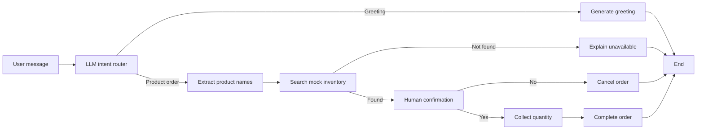
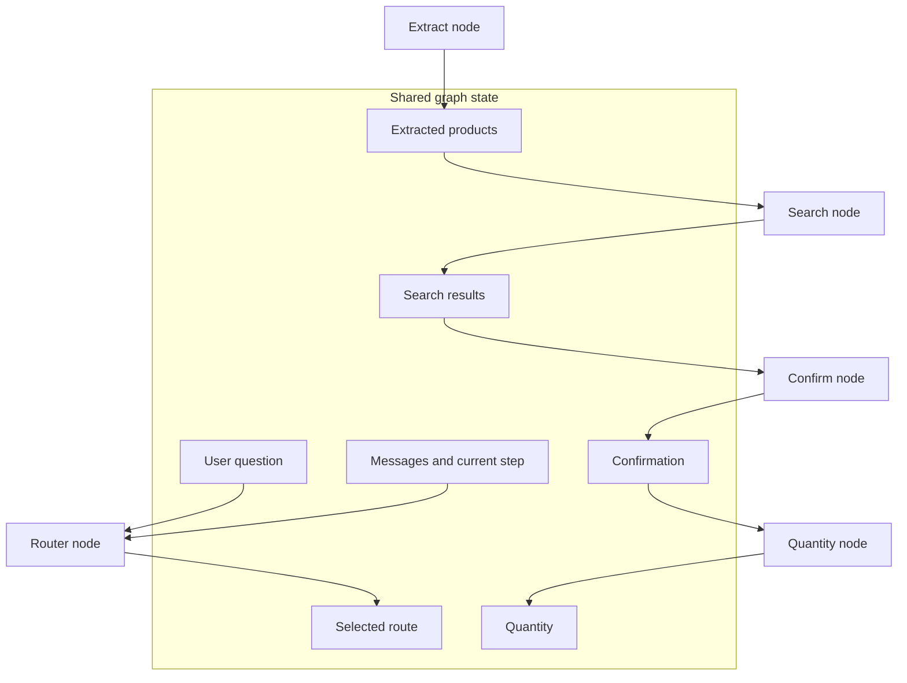
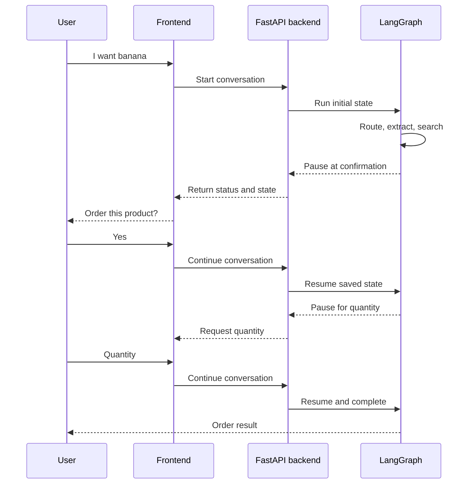
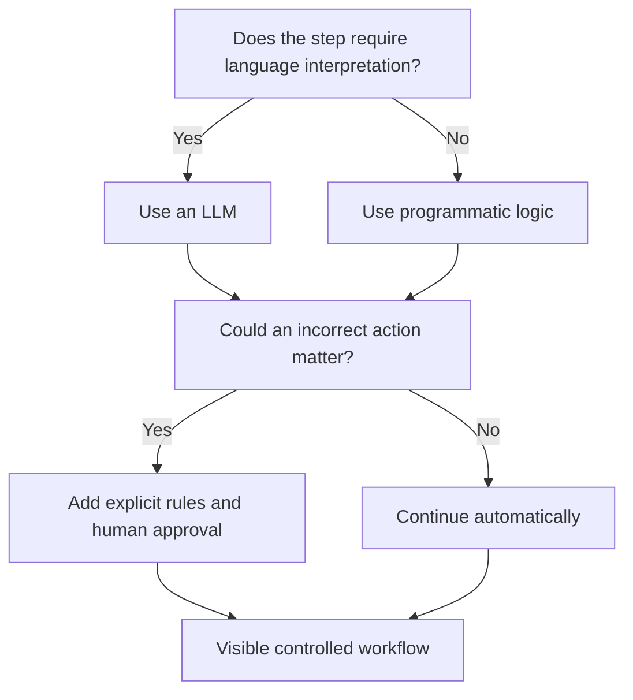

# Human-in-the-Loop Routing with LangGraph

**Visual goal:** See how an LLM interprets a shopping request while LangGraph, deterministic rules, and human checkpoints keep every important action controlled.

[Read the detailed summary](./Summary.md)

## Big picture: controlled intelligence

LangGraph places Generative AI inside an explicit workflow. The model handles ambiguous language, but the graph controls which transitions are possible and pauses before a purchase.

### Responsibility map

| Layer | Best suited for | Example in the lecture |
|---|---|---|
| LLM interpretation | Ambiguous natural language | Classify greeting vs order, extract products |
| Deterministic logic | Constrained, testable choices | Accept `yes` or `no`, branch on search result |
| Human input | Approval and missing information | Confirm purchase, provide quantity |
| LangGraph state | Memory across steps | Route, products, results, confirmation, quantity |

## The graph is a stateful conversation

Nodes perform work. Edges define what may happen next. State carries the information needed by later nodes.

> **Mental model:** Think of LangGraph as a railway map. The LLM may choose an appropriate branch at selected junctions, but the developer lays the tracks, the state carries the cargo, and the human controls the safety gate before the order proceeds.

## Human pause and resume

The application needs separate start and continue operations because the graph can stop while waiting for the learner or customer.

## Why route instead of fully automate?

This design costs more engineering effort because developers must model state, branches, UI behavior, continuation, and termination. Its benefit is predictability, especially when incorrect autonomous actions are unacceptable.

## Visual learning path

1. Start with the top-level split: greeting or product order.
2. Follow the order branch through extraction and inventory search.
3. Notice where deterministic outcomes replace free-form model decisions.
4. Observe the human checkpoints for confirmation and quantity.
5. Connect the paused graph to the frontend and FastAPI continuation flow.

## Check your understanding

1. Which steps benefit from an LLM, and which should remain deterministic?
2. Why must adding edges follow adding nodes?
3. What state must survive when the graph pauses for confirmation?
4. Why does the backend need both start and continue operations?
5. Where does the workflow end after an unavailable product or a `no` response?
