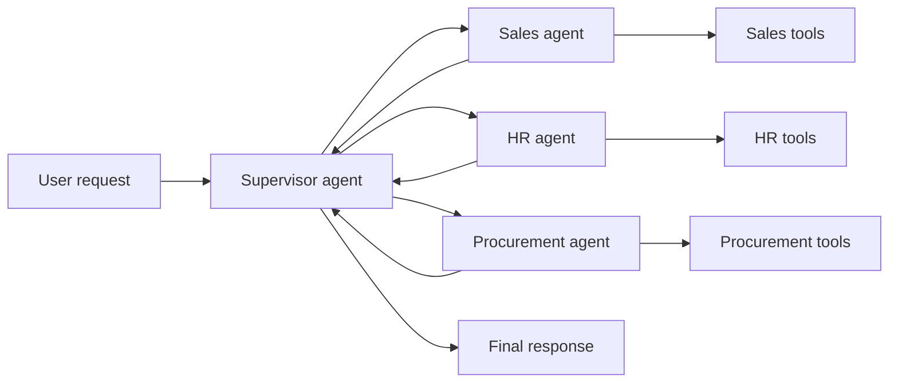
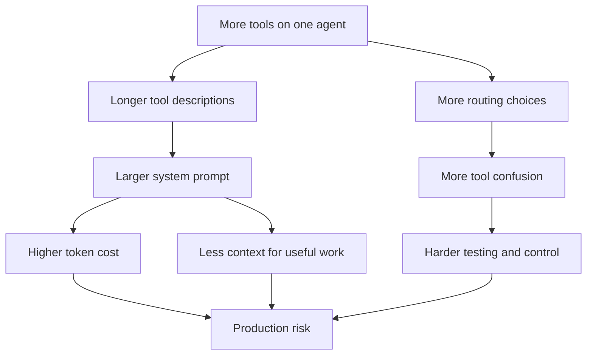
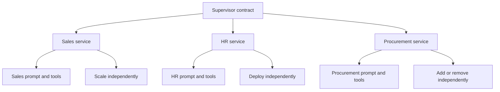
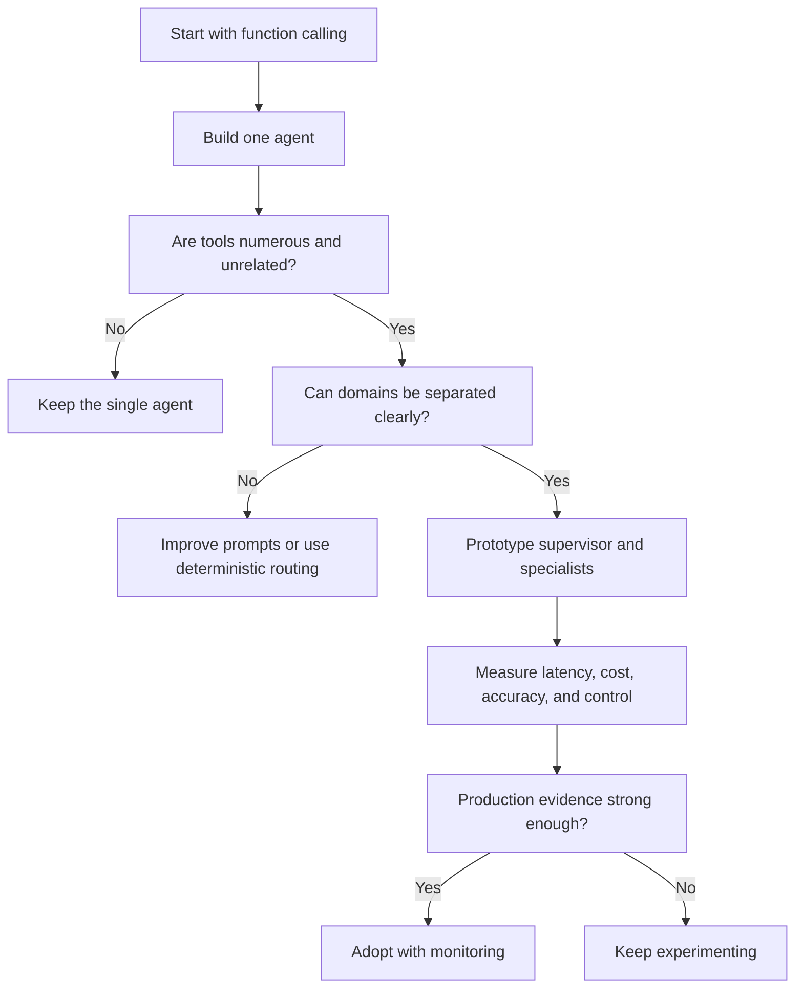

# What Is a Multi-Agent System?

**Visual goal:** Understand when one tool-heavy agent should become a supervisor that coordinates smaller, domain-specialized agents.

[Read the detailed summary](./Summary.md)

## Big picture: distribute responsibilities

A single agent works well with a few tools. As unrelated tools accumulate, prompt complexity, tool confusion, context use, and token cost grow. A multi-agent design groups tools by domain and lets a supervisor route requests.

The supervisor needs domain-level routing knowledge, not every low-level tool. Each specialist receives a narrower prompt and only relevant tools.

## Why the single-agent design becomes difficult

| Design concern | One agent with many tools | Supervisor with specialists |
|---|---|---|
| Prompt scope | Broad and increasingly complex | Narrow per specialist |
| Tool selection | Many unrelated choices | Few domain-relevant choices |
| Deployment | Coupled | Can be independent |
| Scaling | Scale the whole agent | Scale high-traffic agents |
| Request latency | Often fewer handoffs | More model and network calls |
| Operational maturity | Simpler topology | More experimental and complex |

> **Mental model:** Treat the supervisor like a company reception desk. It understands which department owns a request, while each department knows its own procedures and tools. Adding departments improves specialization, but every handoff adds coordination time.

## Separation of concerns

Specialists can evolve similarly to microservices. A change in the Sales agent should not directly alter the HR agent, and traffic-heavy services can receive more resources.

## Architecture decision path

Multi-agent is an option, not a default. The lecture stresses latency, behavioral complexity, and limited production maturity, especially in the current Thai adoption context.

Frameworks such as LangChain, LangGraph, LlamaIndex, CrewAI, and Agent Development Kits can help with prototypes. Learning should progress from provider function calling to a single agent, then to small multi-agent exercises.

## Visual learning path

1. Begin with the single-agent pressure points: prompt size and tool-selection difficulty.
2. Group tools into meaningful business domains.
3. Place a supervisor above the specialist agents.
4. Compare modularity and independent scaling against added handoff latency.
5. Decide from evidence whether multi-agent or deterministic routing is safer for production.

## Check your understanding

1. Why does a large tool list consume context even before a tool is called?
2. What knowledge belongs in the supervisor versus a specialist?
3. How does separation of concerns help deployment and scaling?
4. Why can a multi-agent response be slower?
5. What should a learner master before treating multi-agent architecture as a production option?
