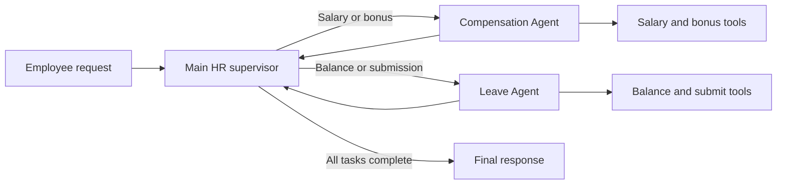
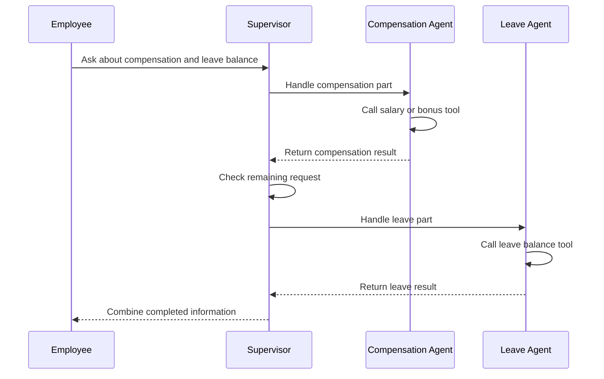
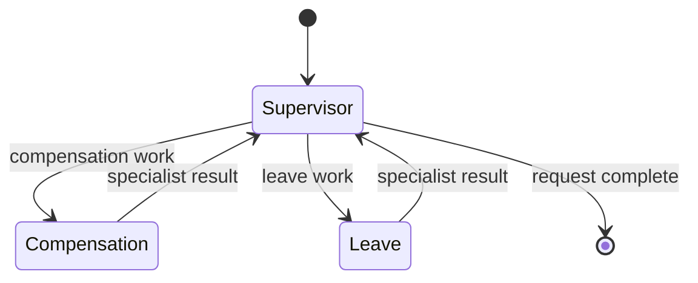
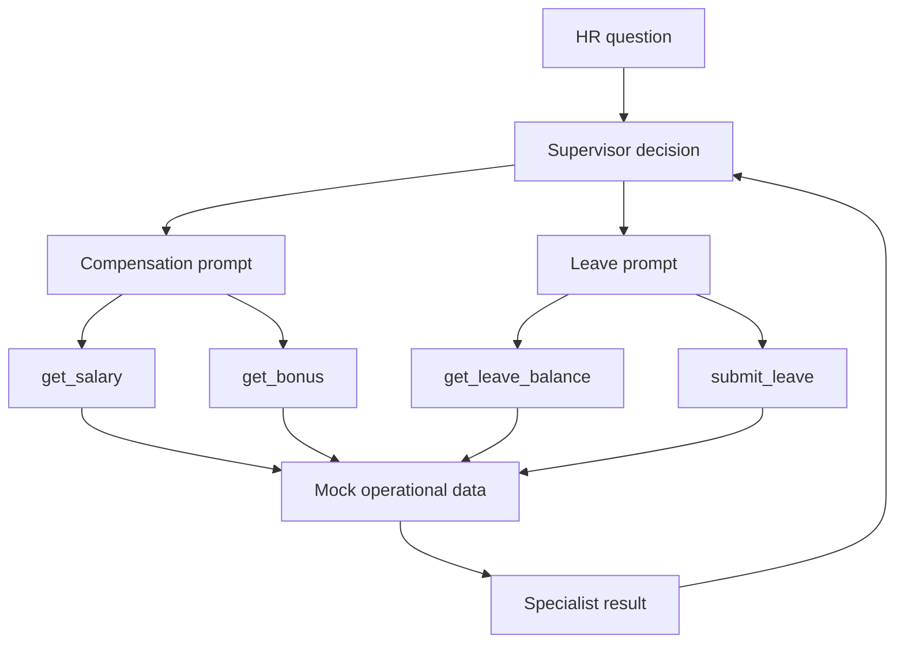

# Coding a Multi-Agent HR System

**Visual goal:** Trace how a LangGraph supervisor uses Compensation and Leave specialists to complete single-domain and cross-domain HR requests.

[Read the detailed summary](./Summary.md)

## Big picture: one coordinator, two specialists

The Main HR Agent receives every request. It delegates domain work, reviews returned results, and either finishes or sends remaining work to another specialist.

| Component | Responsibility | Available tools |
|---|---|---|
| Main HR supervisor | Interpret request, delegate, track remaining work | Transfer to Compensation, transfer to Leave |
| Compensation Agent | Salary and bonus questions | `get_salary`, `get_bonus` |
| Leave Agent | Leave balances and submissions | Leave balance, `submit_leave` |

> **Mental model:** The supervisor is an HR case manager, not merely a classifier. It opens the case, sends each part to the correct specialist, checks what came back, and closes the case only when every requested topic is handled.

## Cross-domain coordination

A request containing compensation and leave cannot end after the first handoff. Specialists return control to the supervisor so it can detect unfinished work.

This return-to-supervisor loop is the key difference between one-time intent routing and ongoing multi-agent orchestration.

## LangGraph topology

The implementation has three principal nodes. Permitted edges make coordination explicit.

Each specialist is a ReAct-style agent created with:

- A Google Gemini model
- A narrow domain prompt
- Only its domain-specific tools

The supervisor instead receives transfer tools and descriptions of specialist responsibilities. Clear prompts and tool descriptions remain essential because the model uses them to choose a handoff.

## Tool and data flow

The notebook uses mock salary, bonus, leave, and employee records. A real implementation might connect to systems such as Workday or SAP, but operational actions require stronger controls.

### Prototype versus production

| Prototype exercise | Production requirement |
|---|---|
| Employee ID supplied in a prompt | Authenticated identity from a trusted session |
| Mock salary and leave data | Authorized access to HR systems |
| Simulated leave submission | Validation, approval, audit, and error handling |
| Happy-path routing tests | Single-domain, combined, failure, and security tests |

## Visual learning path

1. Identify the supervisor and the two specialist domains.
2. Match each specialist to its limited tool set.
3. Follow a simple leave-only or compensation-only request.
4. Trace a combined request through two supervisor loops.
5. Replace mock assumptions mentally with authentication and secure HR integrations.

## Check your understanding

1. Why do both specialist nodes connect back to the supervisor?
2. Which tools should never be exposed to the Compensation Agent?
3. How does the supervisor know a combined request is not finished?
4. Why is a prompt-provided employee ID unsafe for real HR operations?
5. Which test proves orchestration beyond simple routing?
