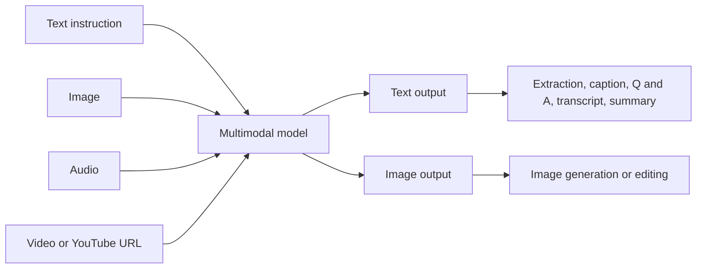
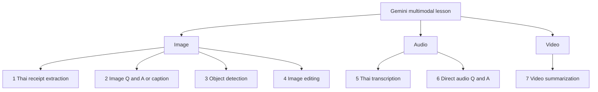
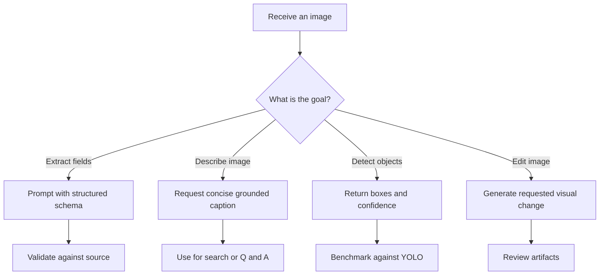
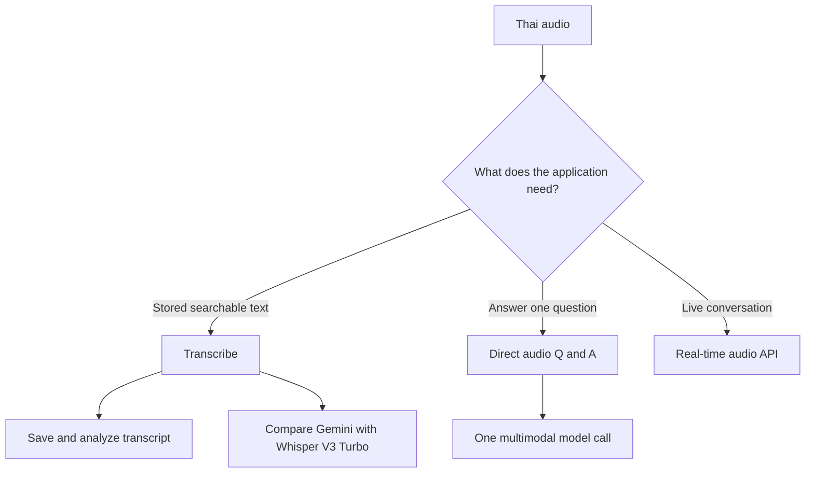
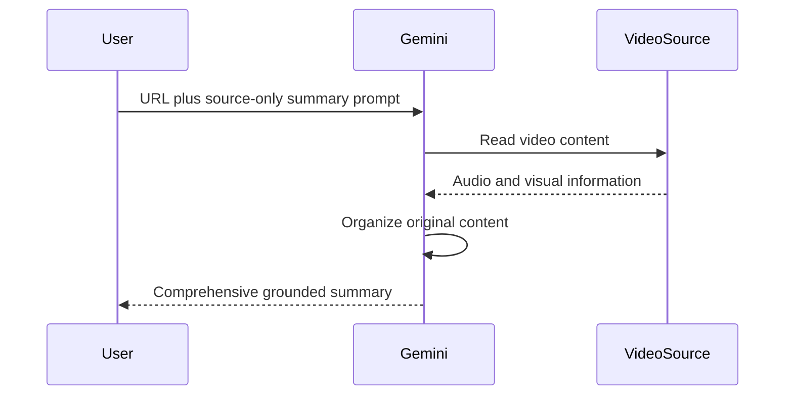
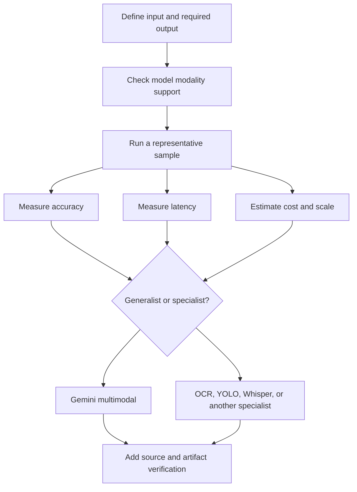

# Multimodal LLMs with 7 Use Cases

**Visual goal:** Map text, image, audio, and video inputs to seven demonstrated Gemini workflows and the specialist models that may be better for production.

[Read the detailed summary](./Summary.md)

## Multimodal input and output map

A model is multimodal because it handles multiple data formats, but each model supports its own specific input and output combinations.

## Seven use cases at a glance

| Use case | Input | Output | Important engineering check |
|---|---|---|---|
| Thai receipt extraction | Image plus prompt | `item` and `amount` list | Verify Thai text and prices |
| Image caption | Poster plus prompt | Concise grounded caption | Avoid assumptions |
| Object detection | Car image | Boxes and confidence | Compare roughly 49-second LLM call with YOLO |
| Image editing | Room image plus instruction | Red-sofa image | Inspect missing details and artifacts |
| Audio transcription | Thai audio plus instruction | Thai transcript | Compare with Whisper V3 Turbo |
| Direct audio Q&A | Audio plus question | Direct answer | Decide whether reusable text is needed |
| Video summary | YouTube URL or video | Source-grounded summary | Restrict output to original content |

> **Mental model:** A multimodal LLM is a generalist with several senses. OCR, YOLO, and Whisper are focused specialists. Select the generalist when flexibility helps, and select the specialist when speed, cost, or scale dominates.

## Image workflow choices

## Audio design decision

## Video summarization sequence

## Model-selection path

## Visual learning path

1. Identify the input modality and the exact output the application needs.
2. Walk through the seven use cases from image extraction to video summary.
3. Notice where structured output connects perception to software.
4. Compare one-step multimodal workflows with specialist pipelines.
5. Add validation for Thai text, coordinates, generated artifacts, and source faithfulness.

## Check your understanding

1. Why does multimodal not mean that every model supports every input and output?
2. What does structured output add to Thai receipt extraction?
3. Why might YOLO be preferable to Gemini for object detection at scale?
4. When is direct audio Q&A better than creating a transcript first?
5. Which prompt constraint helps prevent unsupported claims in a video summary?
