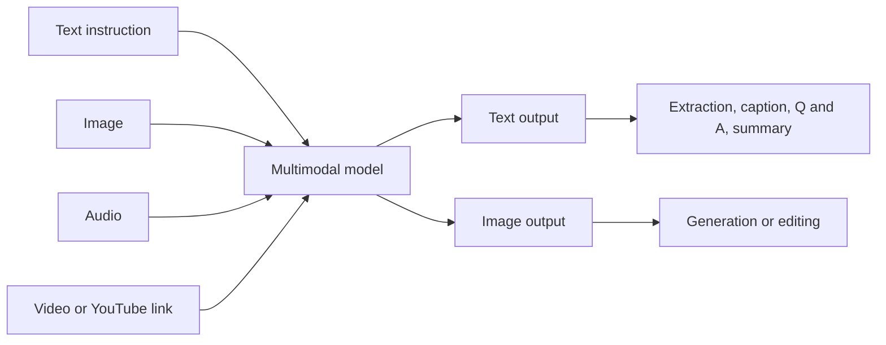
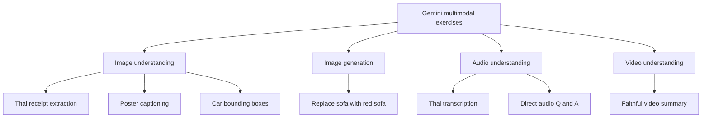
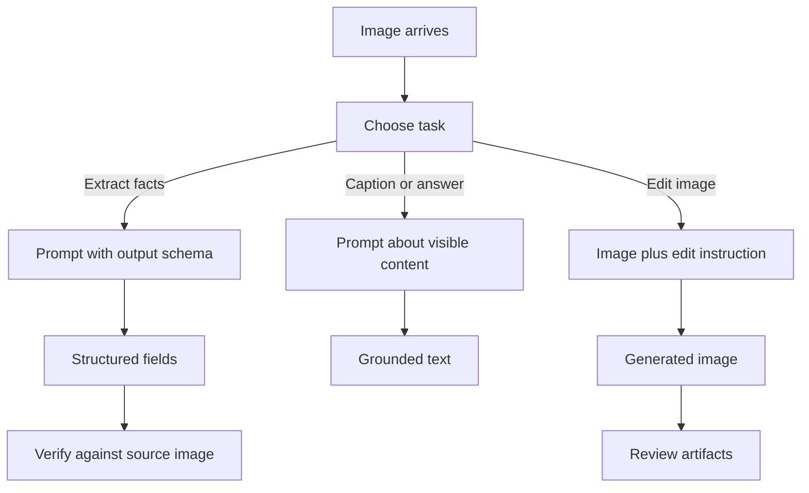
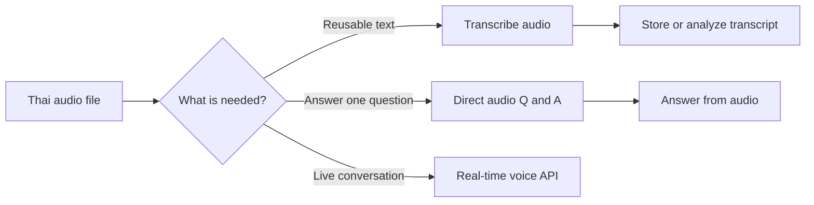
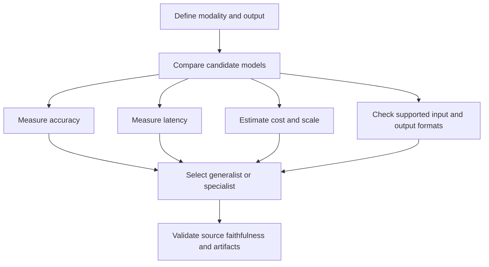

# Introduction to Multimodalities

**Visual goal:** Connect text, image, audio, and video inputs to the demonstrated Gemini tasks and to the specialized alternatives an AI engineer should evaluate.

[Read the detailed summary](./Summary.md)

## Big picture: modality is an engineering choice

A multimodal model can accept or generate more than one data format, but capabilities differ by model. The lecture demonstrates understanding, extraction, generation, editing, transcription, and summarization rather than assuming one model supports every combination.

## Four exercise areas

| Input and task | Demonstrated output | Specialized alternative or caution |
|---|---|---|
| Thai receipt image | Structured `item` and `amount` list | Compare with OCR |
| Car image | Bounding boxes and confidence | YOLO may be much faster at scale |
| Room image plus instruction | Edited room with red sofa | Inspect artifacts and missing details |
| Thai audio | Transcript or direct answer | Compare with Whisper V3 Turbo |
| YouTube video or upload | Source-grounded summary | Prompt against unsupported assumptions |

> **Mental model:** A multimodal LLM is a versatile generalist with several senses. OCR, YOLO, and speech-to-text are focused specialists. Choose between them by the job, not by novelty.

## Image workflows

Structured output turns visual understanding into application-ready data. Generation follows a different path and must include visual review.

For Thai receipts, meaningful Thai item names and local payment context should be preserved. For object detection, the Gemini example found four cars, but its roughly 49-second call illustrates why a specialized detector may be a better production choice.

## Audio pipeline choice

Direct audio Q&A may remove an unnecessary intermediate transcript, while transcription remains useful when the text must be stored, searched, or analyzed later.

## Choosing the implementation

## Visual learning path

1. Identify the input modality and required output before selecting a model.
2. Map each lecture demo to understanding, generation, editing, or summarization.
3. Notice where structured output connects perception to software logic.
4. Compare Gemini with OCR, YOLO, and Whisper using cost, speed, accuracy, and scale.
5. Add verification for extracted facts, generated artifacts, and video claims.

## Check your understanding

1. Why does multimodal not mean every model supports every input and output?
2. When is structured output valuable for a Thai receipt?
3. Why might YOLO be preferable for large-scale object detection?
4. When can direct audio Q&A simplify the pipeline?
5. What prompt constraint helps keep a video summary faithful to its source?
