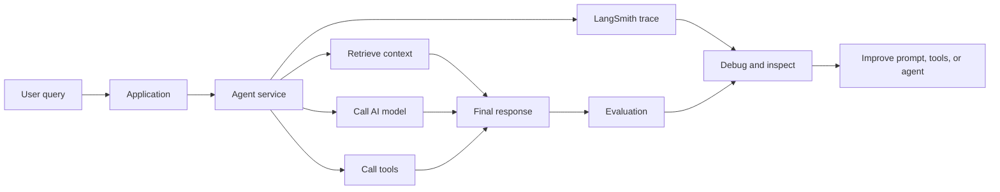
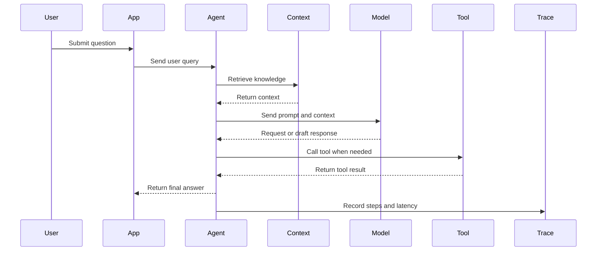
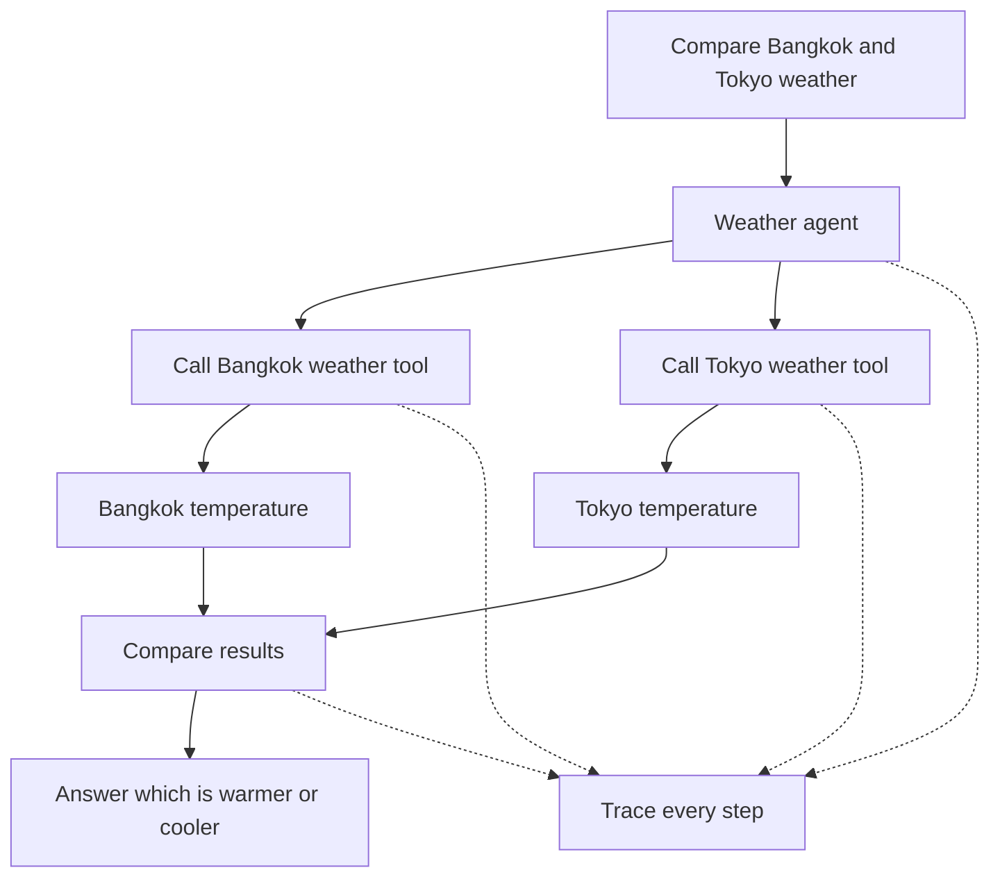
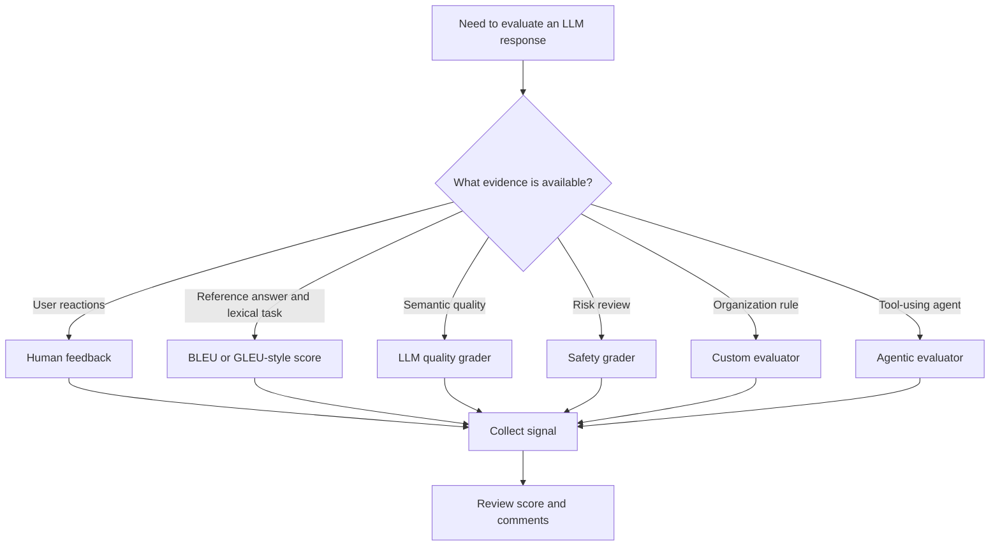
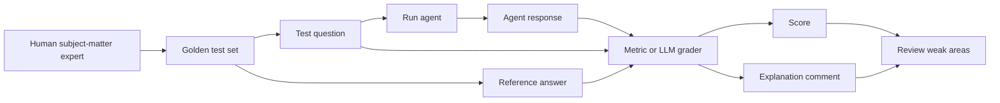
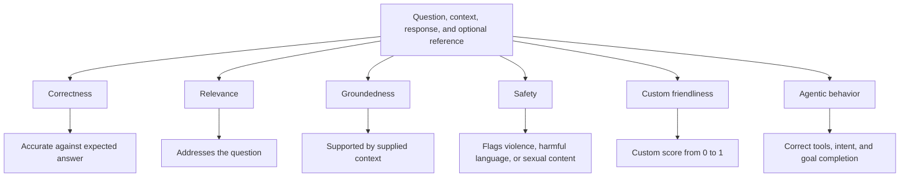
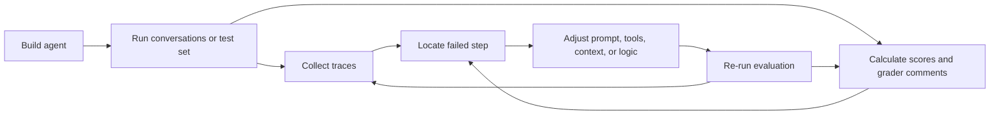
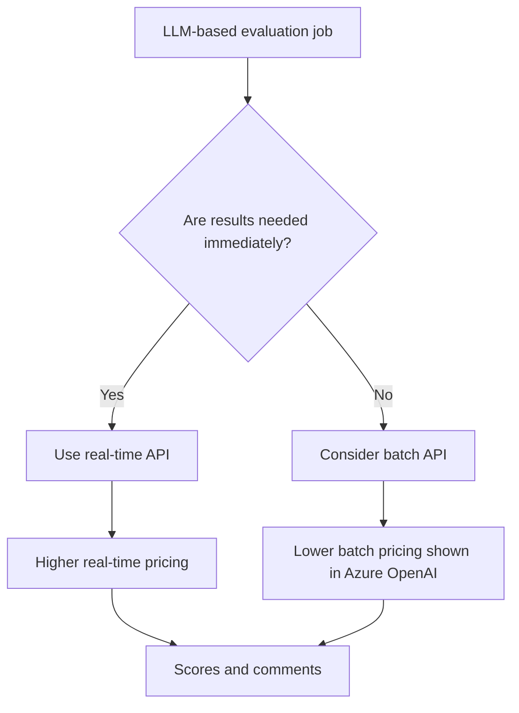

# LLM Logging and Evaluation

**Visual goal:** See how agent traces, evaluation datasets, graders, feedback, and iteration connect from one user query to a measurable improvement workflow.

[Read the detailed summary](./Summary.md)

## Big picture

> **Mental model:** Logging is the agent's flight recorder. Evaluation is the scorecard. The scorecard says where quality is weak, and the flight recorder helps explain what happened.

## Visual learning path

1. Follow one query through the application and Agent Service.
2. Inspect the trace for context, model calls, tools, outputs, and latency.
3. Choose an evaluation method that matches the question being asked.
4. Use a golden test set when trusted reference answers are needed.
5. Read both scores and grader comments.
6. Combine low scores with traces to locate the behavior to improve.
7. Re-run evaluation, using batch APIs when immediate results are unnecessary.

## 1. What a trace captures

The basic chain uses LangSmith's `traceable`. The demonstrated LangChain agent can also be traced automatically when `LANGSMITH_TRACING=true`.

### Trace evidence map

| Trace element | What it tells the developer |
|---|---|
| User input | What the agent was asked |
| Retrieved context | Which knowledge influenced the answer |
| Model call | What prompt or processing step occurred |
| Tool name and input | Whether the agent selected and called the right tool |
| Tool result | Whether external data caused the outcome |
| Final response | What the user received |
| Step duration | Where execution time was spent |

## 2. Demonstrated weather agent trace

If the final comparison is wrong, the trace lets the team distinguish among incorrect tool selection, incorrect tool inputs, incorrect returned temperatures, and incorrect final reasoning.

## 3. Choose the evaluation method

| Evaluation method | Best aligned question | Benefit | Caveat from the lesson |
|---|---|---|---|
| Thumbs, comments, manual grade | Did the user like the answer? | Direct human signal | Depends on users providing feedback |
| BLEU or GLEU-style score | Does wording overlap with a reference? | Fast and no LLM token cost | Meaning can match while wording or order differs |
| LLM quality grader | Is the answer semantically good? | Supports richer judgments | Uses model tokens |
| Safety grader | Is the input or output harmful? | Can flag conversations for review | Criteria and flagged cases still need inspection |
| Custom prompt evaluator | Did the output meet our own rule? | Fits business-specific needs | Evaluator prompt must define the rule well |
| Agentic evaluator | Did the agent use tools and pursue the goal correctly? | Evaluates behavior, not only prose | Requires checks across multiple steps |

## 4. Golden test set to grader

Humans define trusted examples before reference-based evaluation can be meaningful.

The regular exercise example supplies a question, the generated answer, and a reference answer. The displayed correctness score is approximately `0.9`, accompanied by an explanation.

## 5. What the graders measure

### Metric and evidence mapping

| Dimension | Main evidence |
|---|---|
| Correctness | Response plus trusted reference answer |
| Relevance | Question plus response |
| Groundedness | Context or document plus response |
| Safety | User input and model output |
| Friendliness | Organization-defined grading prompt plus response |
| Agentic behavior | Goal, tool calls, intermediate behavior, and final answer |

## 6. Evaluation and observability feedback loop

The transcript supports this connection directly: safety flags can lead to deeper debugging and stronger prompts, while agentic evaluation can reveal incorrect tool use or direction. Traces then expose the corresponding execution steps.

## 7. Cost-aware evaluation

The instructor recommends considering batch APIs for evaluation because grading often does not require an immediate response. No exact price or submission command is given.

## Check your understanding

1. Why is a final answer log insufficient for debugging a tool-using agent?
2. What is the difference between `traceable` instrumentation and `LANGSMITH_TRACING=true` in the demonstrations?
3. Why can a BLEU or GLEU-style score be low even when two answers express similar meaning?
4. Which inputs are needed to evaluate correctness, relevance, and groundedness?
5. How do an evaluation score and a trace play different roles in improving an agent?
